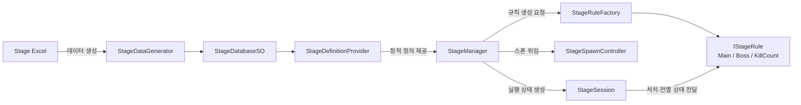
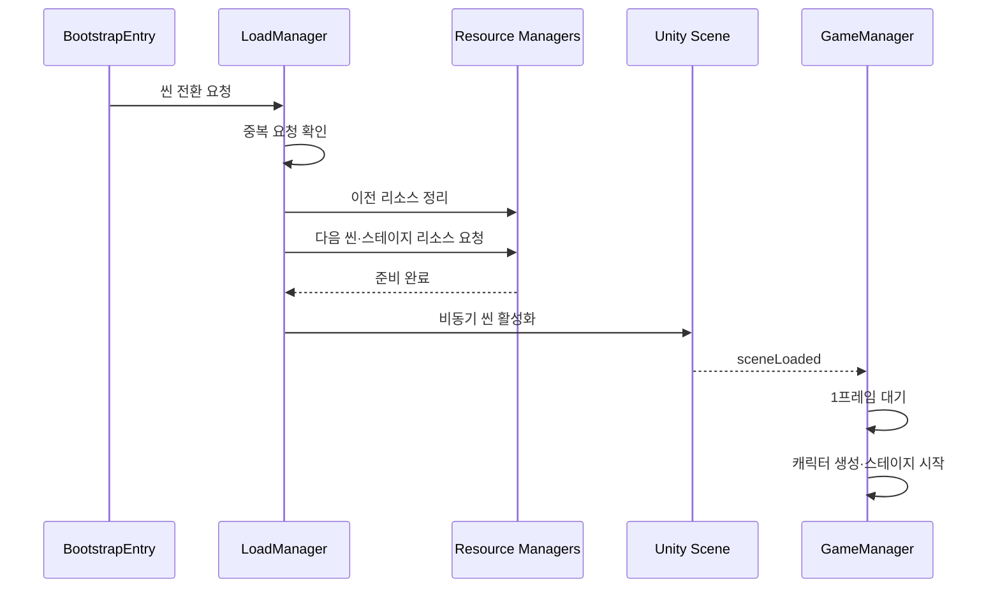
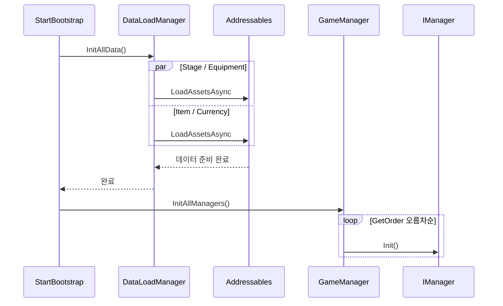
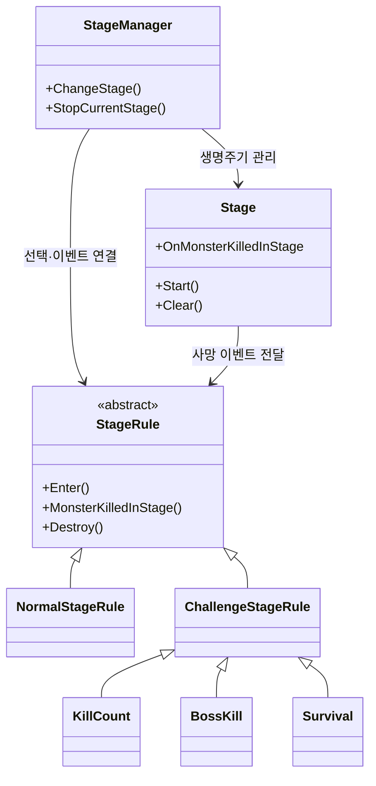
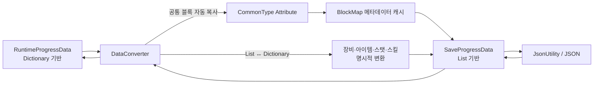
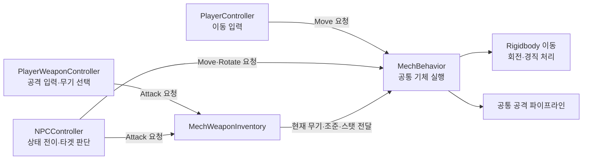
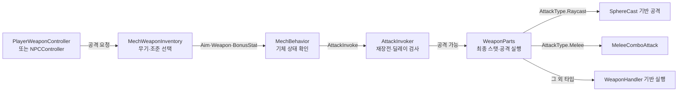
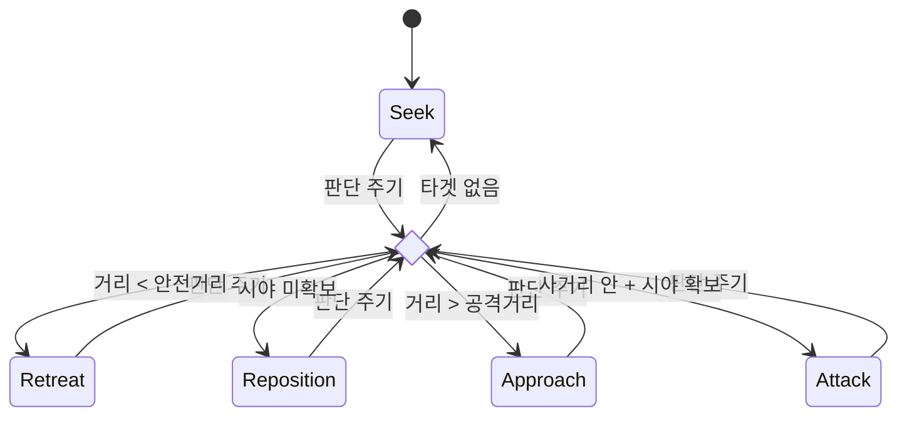
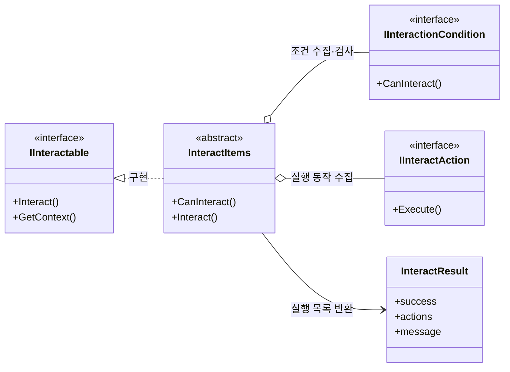
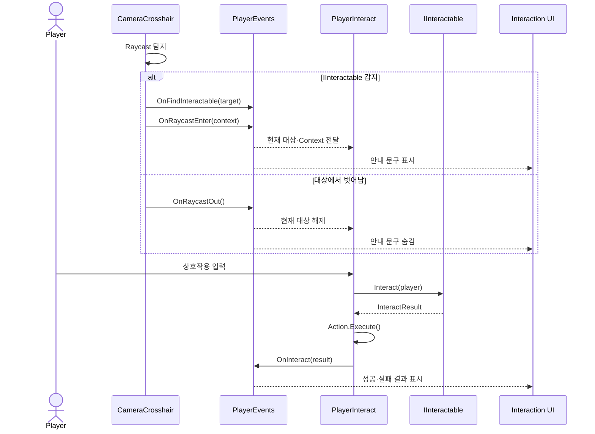

# 문규성 포트폴리오


Unity와 C#을 기반으로 전투, 스테이지, 데이터 저장/로드, 상호작용 시스템을 직접 설계하고 구현해 온 게임 클라이언트 개발자 지원자입니다. 

프로젝트를 반복하며 이전 구현의 한계를 다음 설계 원칙으로 전환해 왔습니다. 팀 프로젝트에서는 **공통 프레임워크**, **초기화·데이터 규약**, **기능 간 책임 경계**, **통합 기준**을 세우는 기술 리드 역할을 맡았습니다.

새 기능을 빠르게 추가하는 것뿐 아니라, 초기화 순서, 데이터 구조, 책임 분리, 확장 단위처럼 유지보수성과 협업 효율에 영향을 주는 문제를 구조적으로 해결하는 데 집중합니다.
<br clear="left"/>

## 기술 스택

| 구분 | 기술 |
| --- | --- |
| Language |  |
| Engine |  |
| Library / SDK |   |
| Data |   |
| Collaboration |    |

## 핵심 기술

- [콘텐츠 규칙과 런타임 상태 분리](#project-k-stage): 프로젝트의 스테이지·던전 구조 재설계
- [게임 로딩 리팩토링](#project-k-loading): 게임 실행시 로딩 구조 재설계
- [초기화·데이터 준비 상태 보장](#idle-hero-bootstrap): Addressables 로딩 이후 매니저 초기화
- [입력 주체와 전투 실행 계층 분리](#personal-combat): 플레이어와 AI의 공통 실행 흐름
- [컴포넌트 조합형 상호작용](#kamikakushi-interaction): 탐지·실행·UI 책임 분리

## 성장 흐름

| 단계 | 프로젝트 | 확인한 한계 | 개선내용 |
| --- | --- | --- | --- |
| 1 | 카미카쿠시 | 게임시작 및 씬 전환시 데이터 준비시점 고려 필요 | [기능 구현 전 데이터 준비 시점과 진입 순서를 명시](idle-hero-bootstrap) |
| 2 | 그때 갑자기 건담이 나타났다 | UI 일정 편중과 일부 클래스의 과도한 책임 | MVP우선 구현 및 [실행 책임 분산](idle-hero-stage) |
| 3 | 귀차니즘 용사 | 정수 우선순위와 분기 기반 규칙 선택의 확장 한계 | [데이터 정의·실행 상태·규칙·생성 책임 세분화](project-k-stage) |

## 프로젝트 목차

| 구분 | 프로젝트 | 장르 | 기간 | 역할 | 연결 링크 |
| --- | --- | --- | --- | --- | --- |
| 팀 프로젝트 | [왕국군 키우기](#project-k) | 방치형 RPG | 프로젝트 2026.02–진행 중<br>본인 참여 2026.05–진행 중 | 클라이언트 개발 | [YouTube](https://www.youtube.com/watch?v=PBKFwkjvW5U) |
| 팀 프로젝트 | [귀차니즘 용사](#team-project-2) | 방치형 RPG | 2026.03.03 - 2026.04.15 | 클라이언트 리드 | [GitHub](https://github.com/ks0521/TeamProject)<br>[YouTube](https://youtu.be/7LdXl2Ow0QU) |
| 개인 프로젝트| [그때 갑자기 건담이 나타났다](#personal-project) | TPS 로그라이크 | 2026.01.29 - 2026.02.27 | 1인 개발 | [GitHub](https://github.com/ks0521/SingleProject)|
| 팀 프로젝트 | [카미카쿠시](#team-project-1) | 공포 | 2025.12.10 - 2025.12.26 | 클라이언트 리드 | [GitHub](https://github.com/ks0521/First-Game-Project)<br>[YouTube](https://www.youtube.com/watch?v=v1zOEZXVuqY) |

---
<div style="page-break-before: always;"></div>

<a id="project-k"></a>
# 진행 중 프로젝트: 왕국군 키우기

<p align="center">
  
  
</p>

3명이 실제 출시를 목표로 제작 중인 방치형 RPG입니다. 기존 프로토타입의 기능을 유지하면서 콘텐츠 추가와 운영에 대응할 수 있도록 스테이지, 장비, 성장 구조를 재정리하고 있습니다.

- 프로젝트 기간: 2026.02–진행 중
- 본인 참여 기간: 2026.05–진행 중
- 팀 구성: 3인 개발
- 본인 역할: 클라이언트 개발
- 개발 환경: Unity 6, C#, UniTask, Addressables

<a id="project-k-stage"></a>
## 🧩 핵심 기여 1. 스테이지 데이터·실행 상태·규칙 분리

> **문제**  
> 기존 흐름에서는 메인 스테이지 진행, 몬스터 생명주기, 클리어 판정, 던전 진입·복귀가 여러 매니저에 걸쳐 있었습니다. 진행 방식이 다른 콘텐츠가 늘어날수록 기존 코드를 함께 수정해야 했습니다.

### 해결

정적 콘텐츠 정의는 `StageDefinition`, 현재 실행 중인 몬스터와 처치 상태는 `StageSession`, 성공·실패 판정은 `IStageRule`로 분리했습니다. `StageManager`는 이들을 조합해 메인 진행, 보스 도전, 처치 수 조건, 던전 진입과 복귀를 조정합니다.



실제 규칙 선택은 데이터에 기록된 `FlowType`을 기준으로 팩토리가 담당합니다.

```csharp
public static IStageRule Create(StageDefinition definition)
{
    return definition.FlowType switch
    {
        eStageFlowType.MainProgression   => new MainStageRule(),
        eStageFlowType.BossChallenge    => new BossStageRule(),
        eStageFlowType.KillCountChallenge => new KillCountRule(),
        _ => throw new ArgumentOutOfRangeException(nameof(definition.FlowType))
    };
}
```

### 결과

- 스테이지 데이터, 실행 중 상태, 판정 규칙의 변경 이유를 분리했습니다.
- 메인 진행 상태를 보존한 뒤 던전에서 복귀시 기존 진행상태를 유지하는 흐름을 추가했습니다.
- 스테이지 클리어 이벤트를 퀘스트 등 다른 콘텐츠가 구독할 수 있는 기준점으로 만들었습니다.
- 새 진행 규칙을 추가할 때 기존 스폰·세션 코드를 직접 수정하는 범위를 줄였습니다.

### 개선사항

`StageManager`가 아직 진입·복귀·팝업 이벤트까지 조정하는 큰 클래스여서 콘텐츠 종류가 더 늘어나면 화면 전환과 사용자 피드백을 별도로 분리할 필요가 있습니다.<br/>
데이터 생성과 리소스 로딩 실패 후 사용자가 다시 시도할 수 있는 복구 흐름도 출시 전 검증 대상입니다.

<a id="project-k-loading"></a>
## 🧩 핵심 기여 2. 게임실행구조 리팩토링

> **문제**  
> 기존 `GameManager`는 씬 전환, Addressables 리소스 준비, 로딩 완료 대기, 리소스 해제, 캐릭터 생성과 게임 시작까지 함께 담당했습니다.
>
> 이로 인해 로딩 정책을 변경할 때 런타임 게임 상태까지 영향을 받을 수 있었고 리소스 준비와 씬 활성화, 씬 객체 초기화와 게임 시작 사이의 실행 순서도 한 클래스 내부에 섞여 있었습니다.

### 해결

기존 Addressables와 SFX/VFX 로딩 기반은 유지하면서 역할을 다음과 같이 분리했습니다.

- `BootstrapEntry`: 전역 시스템이 실행되는 최초 진입점
- `LoadManager`: 중복 전환 방지, 리소스 준비·대기, Unity 씬 활성화, 해제 시점 조정
- `GameManager`: 씬 객체 초기화 이후 캐릭터 생성과 게임플레이 시작
- `SFXManager` / `VFXManager`: 자신이 생성한 SFX / VFX 캐시와 Addressables handle 관리



메인 씬은 스테이지에서 사용할 몬스터, SFX, VFX 준비가 끝난 뒤 활성화하도록 순서를 고정했습니다.

```csharp
private async UniTask LoadingMainScene()
{
    eSceneType type = eSceneType.main;

    StageResourceCache cache = LoadStageResources(type);
    LoadSceneResources(type);

    await WaitForLoadingResources(
        cache,
        _loadingToken.Token);

    await LoadUnitySceneAsync(type);
}
```

또한 `sceneLoaded` 직후에는 새 씬 객체의 `Start()`가 끝나지 않았을 수 있어 한 프레임을 기다린 뒤 캐릭터 생성과 스테이지 시작을 수행하도록 했습니다.

구조를 분석하는 과정에서 VFX 배치 로딩이 요청 ID 배열과 Addressables 반환 배열의 순서가 같다고 가정한 문제도 발견했습니다.

이는 기존의 인덱스 기반 매핑 대신 실제로 반환된 프리팹의 이름으로 `eVFXType`을 판별해 캐시에 등록하도록 수정했습니다.

```csharp
foreach (GameObject obj in result)
{
    if (!Enum.TryParse(obj.name, out eVFXType key))
        continue;

    VFXEntity resource = obj.GetComponent<VFXEntity>();

    if (resource == null)
        continue;

    CacheAssets(key, resource);
}
```

### 결과

- 씬 전환과 리소스 준비의 진입점을 `LoadManager`로 모았습니다.
- 필수 리소스 준비 → Unity 씬 활성화 → 씬 객체 초기화 → 게임 시작 순서를 명시했습니다.
- `GameManager`는 로딩 구현에서 분리되어 런타임 게임 상태와 시작 흐름에 집중하게 됐습니다.
- 캐시와 Addressables handle을 실제로 소유한 매니저가 함께 해제하도록 책임을 정리했습니다.
- 요청 순서와 반환 순서가 다를 때 다른 VFX가 캐시에 연결될 수 있었던 잠재 오류를 제거했습니다.

### 개선사항

씬별 로딩 방식 선택은 아직 `switch`에 남아 있어 씬 종류가 늘어나면 별도 로딩 전략으로 분리할 필요가 있습니다.

VFX 매핑은 프리팹 이름과 `eVFXType` 이름이 같다는 규칙에 의존하므로, 규모가 커지면 명시적인 `ID → AssetReference` 매핑이나 에디터 검증 도구가 필요합니다.

### 관련 코드

- `BootstrapEntry.cs`
- `LoadManager.cs`
- `GameManager.cs`
- `SFXManager.cs`
- `VFXManager.cs`
- `MonsterSpawner.cs`

## 🧩 핵심 기여 3. 정책과 실행을 분리한 로컬 환생 프로토타입

> **문제**  
> 환생 가능 조건, 보상 계산, 저장, 스테이지 초기화를 한 흐름에서 처리하면 실패 지점에 따라 데이터와 현재 스테이지가 어긋날 수 있습니다.

### 해결

- `ReincarnationPolicy`: 현재 상태와 스테이지를 바탕으로 가능 여부와 다음 상태 계산
- `ReincarnationService`: 미리보기, 중복 실행 방지, 저장·초기화 순서 조정
- `ReincarnationStore`: 스키마 버전과 손상 데이터를 고려한 로컬 저장
- `ReincarnationGateway`: 환생 로직이 `StageManager` 구현을 직접 알지 않도록 전환 요청 캡슐화

스테이지 초기화 요청이 실패하면 저장했던 환생 상태를 이전 값으로 되돌립니다.

```csharp
if (!_store.TrySave(preview.NextState))
    return ReincarnationExecutionResult.SaveFailed;

if (!_stageGateway.TryResetToStartStage())
{
    if (!_store.TrySave(previousState))
        return ReincarnationExecutionResult.RollbackFailed;

    return ReincarnationExecutionResult.StageResetRejected;
}
```

### 개선사항

현재 구현은 `PlayerPrefs` JSON 기반 로컬 프로토타입입니다. 스테이지 전환 요청 수락이 실제 비동기 로딩 완료를 보장하지 않으므로 서버 도입 시 환생 상태와 시작 스테이지를 하나의 트랜잭션으로 확정해야 합니다.

---

<a id="team-project-2"></a>
# 2차 팀 프로젝트: 귀차니즘 용사

<p align="center">
  
  
</p>

<p align="center">
  <b>일반 스테이지 파밍과 보스 스테이지 돌파로 이어지는 방치형 RPG</b><br/>
  <sub>클라이언트 리드로 공통 프레임워크와 초기화·데이터·이벤트 규약, 통합 흐름을 담당했습니다.</sub>
</p>


- 개발 기간: 2026.03.03 - 2026.04.15, 약 6주
- 팀 구성: 개발 4인
- 본인 역할: 클라이언트 리드
- 개발 환경: Unity 2022.3.62f3 LTS, C#, UniTask, Addressables
- GitHub: [https://github.com/ks0521/TeamProject](https://github.com/ks0521/TeamProject)
- 시연 영상: [YouTube](https://youtu.be/7LdXl2Ow0QU)

<a id="idle-hero-bootstrap"></a>
## 🧩 핵심 구현 1. 데이터 로딩과 매니저 초기화 파이프라인

> **문제**  
> 팀 코드를 통합하면서 Unity 생명주기와 매니저 의존성이 얽혔고, 필수 데이터가 준비되기 전에 시스템이 참조될 위험이 있었습니다.

### 해결

`StartBootstrap`을 단일 진입점으로 두고 Stage, Equipment, Item, Currency 데이터를 병렬 로딩했습니다. 데이터 준비가 끝난 뒤에만 `GameManager`가 `IManager` 구현체를 우선순위대로 초기화합니다.



```csharp
// StartBootstrap.cs
await dataLoadManager.InitAllData(dic);
gameManager.InitAllManagers();

// DataLoadManager.cs
await UniTask.WhenAll(
    LoadAllStage(),
    LoadAllEquipment(),
    LoadAllItems(),
    LoadAllCurrency()
);
```


### 결과

- 데이터 그룹의 준비 완료 시점을 매니저 초기화보다 앞에 고정했습니다.
- 신규 매니저는 `IManager` 구현과 우선순위 지정으로 초기화 흐름에 편입할 수 있습니다.
- 데이터 로딩 실패를 부트스트랩 단계에서 감지할 수 있습니다.

### 개선사항

 정수기준 우선순위는 단순하지만 값 충돌과 숨은 의존성을 만들 수 있었습니다. 규모가 커지면 실제 의존 대상을 명시하는 그래프 또는 DI 기반 초기화로 전환해야 할 필요성을 경험했습니다.

### 관련 코드

- [StartBootstrap.cs](https://github.com/ks0521/TeamProject/blob/main/Assets/Game/Base/Data/Script/StartBootstrap.cs)
- [DataLoadManager.cs](https://github.com/ks0521/TeamProject/blob/main/Assets/Game/Base/Managers/DataLoadManager.cs)
- [GameManager.cs](https://github.com/ks0521/TeamProject/blob/main/Assets/Game/Base/Managers/GameManager.cs)

<a id="idle-hero-stage"></a>
## 🧩 핵심 구현 2. StageManager / Stage / StageRule 기반 스테이지 구조 분리

> **문제**  
> 전환, 스폰, 클리어 판정, 보상을 한 흐름에서 처리하면 새로운 규칙을 추가할 때 진행 코드 전체를 수정해야 했습니다.

### 해결



`StageManager`는 전환과 진행 상태, `Stage`는 스폰과 몬스터 생명주기, `StageRule`은 클리어 조건과 보상을 담당합니다. 일반 보상, 처치 수, 보스 처치, 생존 규칙을 기존 진행 흐름에 연결했습니다.

### 한계
현재 규칙 선택은 `StageManager`의 분기에 남아 있습니다. 이 한계는 다음 프로젝트에서 `StageDefinition`과 `StageRuleFactory`를 도입하는 계기가 됐습니다.

### 관련 코드

- [StageManager.cs](https://github.com/ks0521/TeamProject/blob/main/Assets/Game/Base/Managers/StageManager.cs)
- [Stage.cs](https://github.com/ks0521/TeamProject/blob/main/Assets/Game/Battle/Script/Stage.cs)
- [StageRule.cs](https://github.com/ks0521/TeamProject/blob/main/Assets/Game/Battle/Script/StageRule.cs)
<div style="page-break-before: always;"></div>

## 🧩 핵심 구현 3. Attribute / Reflection 기반 저장 데이터 자동 매핑

> **문제**  
> Unity `JsonUtility`는 `Dictionary` 직렬화를 지원하지 않아 저장용 데이터와 런타임 데이터 타입을 분리해야 했습니다.  
> 콘텐츠가 늘어나면서 공통 필드를 모두 수동 복사하여 전환 시 누락 위험이 생겼습니다.

### 해결


공통 블록은 `[CommonType]`속성을 붙여 Reflection으로 자동 복사하고, 장비·아이템·스탯·스킬처럼 `List ↔ Dictionary` 변환이 필요한 블록만 명시적으로 변환했습니다. 
<br/>필드 이름과 타입 정보같은 Reflection에 필요한 메타데이터는 `BlockMap`으로 캐싱해 저장/로드 시 반복 탐색 비용도 줄였습니다.

### 한계
Reflection은 컴파일 단계 검증이 약하므로 필드 이름 변경 시 경고와 변환 테스트가 필요합니다. 
<br/>이 프로젝트에서는 구조를 구현했지만 자동화된 회귀 테스트까지는 완성하지 못했습니다.

### 관련 코드

- [DataConverter.cs](https://github.com/ks0521/TeamProject/blob/main/Assets/Game/Base/Save/DataConverter.cs)
- [CommonTypeData.cs](https://github.com/ks0521/TeamProject/blob/main/Assets/Game/Base/Save/CommonTypeData.cs)

## ✍️ 회고

### 협업/운영 측면
이번 프로젝트에서는 기능 구현보다 먼저 **초기화 순서**, **데이터 진입점**, **이벤트 규약**을 문서로 합의했습니다.  
초기에 합의 비용은 들었지만, 병렬 개발 단계에서 **누가 언제 어떤 데이터를 신뢰할 수 있는지** 기준이 명확해져 통합 충돌을 줄일 수 있었습니다.  
특히 후반부 QA에서 이슈를 수정할 때 원인 추적 경로가 짧아져, 기능 간 책임 경계를 재확인하는 데 도움이 됐습니다.

### 기술적 측면
1차 팀 프로젝트에서 겪었던 초기화 타이밍 이슈를 해결하기 위해 `StartBootstrap → DataLoadManager → GameManager` 순서로 진입점을 고정했습니다.  
또한 개인 프로젝트에서 검증한 책임 분리 원칙을 `StageManager / Stage / StageRule`로 확장해, 스테이지 규칙을 교체 가능한 단위로 분리했습니다.  
결과적으로 **초기화 안정성**, **데이터 준비 상태 보장**, **콘텐츠 규칙 확장성**을 확보했습니다.

그러나 

---
<div style="page-break-before: always;"></div>

<a id="personal-project"></a>
# 개인 프로젝트: 그때 갑자기 건담이 나타났다

<p align="center">
  
  
</p>


<p align="center">
  <b>불리한 전투 상황을 돌파하며 무작위 보상으로 기체를 강화하는 TPS 로그라이크</b><br/>
  <sub>1인 개발로 플레이어/AI 공통 전투 실행 계층, 공격 파이프라인, 상태 전이 기반 NPC AI를 구현했습니다.</sub>
</p>

- 개발 기간: 2026.01.29 - 2026.02.27, 총 4주
- 후속 보완: 2026.03–04, 공격 파이프라인 책임 재정리와 오류 수정
- 팀 구성: 1인 개발
- 개발 환경: Unity 2022.3.62f3 LTS, C#, UniTask
- GitHub: [https://github.com/ks0521/SingleProject](https://github.com/ks0521/SingleProject)
- 기획서: [Notion](https://www.notion.so/2f110afad1cd80fd868de0a4df86b3fe)

<a id="personal-combat"></a>
## 🧩 핵심 구현 1. 입력 · 판단과 공통 전투 실행 분리

> **문제**  
> 플레이어와 AI는 입력을 결정하는 방식이 다르지만 실제 기체의 이동·회전·공격·피격 경직은 동일한 규칙으로 동작합니다.
> <br/>각 컨트롤러가 기체 동작을 직접 구현하면 같은 기능이 중복되고, 물리 이동이나 경직 처리 방식을 변경할 때 양쪽 코드를 함께 수정해야 하는 문제가 있었습니다.

### 해결

플레이어 입력과 AI 판단은 각각의 컨트롤러에 남겨두고 실제 기체 동작은 MechBehavior에서 공통으로 실행하도록 분리했습니다.

플레이어 측에서는 PlayerController가 이동 입력을 해석하고 PlayerWeaponController가 공격 입력과 무기 교체를 담당합니다. AI 측에서는 NPCController가 현재 상태와 타겟 조건을 바탕으로 이동 방향과 공격 시점을 결정합니다.

두 주체가 결정한 이동과 공격 요청은 MechBehavior로 전달되며, MechBehavior는 Rigidbody 기반 이동, 방향 전환, 공격 실행 요청, 피격 경직처럼 기체에 공통으로 필요한 동작을 처리합니다.



### 효과

- 입력 주체가 달라도 동일한 전투 실행 로직을 재사용할 수 있었습니다
- 이동/공격/피격 경직 같은 핵심 동작의 수정 지점을 `MechBehavior` 중심으로 모을 수 있었습니다.
- Raycast, 근접 공격, handler 기반 공격을 동일한 무기 진입점에서 분기합니다.

### 관련 코드

- [PlayerController.cs](https://github.com/ks0521/SingleProject/blob/main/Assets/Gundam/Game/Script/Contents/Player/PlayerController.cs)
- [NPCController.cs](https://github.com/ks0521/SingleProject/blob/main/Assets/Gundam/Game/Script/Contents/NPC/NPCController.cs)
- [MechBehavior.cs](https://github.com/ks0521/SingleProject/blob/main/Assets/Gundam/Game/Script/Contents/Mech/MechBehavior.cs)
<div style="page-break-before: always;"></div>

## 🧩 핵심 구현 2. AttackInvoker / WeaponParts 기반 공격 파이프라인 책임 분리

> **문제**  
> 기존에는 공격 요청 처리, 재장전·공격 딜레이 검사, 최종 스탯 계산, 무기 타입별 실행, 탄약과 재장전 상태를 한 클래스에서 관리하는 방식을 사용했지만 이로인해 새로운 공격 방식을 추가하거나 공격 실패 원인을 추적하기 어려웠습니다.

### 해결



공격 흐름을 요청 전달, 공격 가능 판정, 무기별 실행의 세 단계로 분리했습니다.

MechWeaponInventory는 현재 무기와 조준 정보를 선택하고 MechBehavior는 기체가 공격 가능한 상태인지 확인한 뒤 요청을 AttackInvoker에 전달합니다.

AttackInvoker는 현재 무기의 재장전 상태와 공격 딜레이를 검사합니다. <br/>공격할 수 있는 경우에만 WeaponParts.Attack()을 호출하며 WeaponParts는 무기 데이터와 추가 스탯을 조합해 최종 공격 수치를 계산하고 공격 타입에 맞는 실행 경로를 선택합니다.

### 효과

공격이 실행되지 않았을 때 원인을 다음 단계로 나누어 확인할 수 있게 되었습니다.

`입력·AI 판단
→ 현재 무기 선택
→ 기체 제어 가능 여부
→ 재장전·공격 딜레이
→ 무기별 공격 실행`

공격 가능 판정과 실제 공격 방식이 분리되어 Raycast와 근접 공격처럼 실행 방식이 다른 무기도 동일한 진입점을 사용할 수 있게 되었습니다. 

무기별 탄약과 딜레이 상태도 각 WeaponParts 인스턴스가 관리하므로 무기 교체 시 상태를 독립적으로 유지할 수 있습니다.

### 개선사항

WeaponParts가 최종 스탯 계산, 공격 타입 분기, 탄약, 딜레이, 재장전까지 담당해 책임이 여전히 많습니다. <br/>
공격 타입이 더 늘어난다면 공격타입별 실행을 각각 전략 객체로 분리하고, WeaponParts는 무기 상태와 실행 전략 선택만 담당하도록 개선하는 방식을 고려하고 있습니다.

공격 실패 결과가 현재 bool 중심이므로 실패 원인을 구분할 수 없습니다.<br/>
UI나 AI가 실패 원인을 구분해야 한다면 Reloading, Delay, CannotControl, NoAmmo와 같은 명시적인 결과 타입이 필요합니다.

### 관련 코드

- [AttackInvoker.cs](https://github.com/ks0521/SingleProject/blob/main/Assets/Gundam/Game/Script/Contents/Mech/AttackInvoker.cs)
- [WeaponParts.cs](https://github.com/ks0521/SingleProject/blob/main/Assets/Gundam/Game/Script/Contents/Weapon/WeaponParts.cs)
<div style="page-break-before: always;"></div>

## 🧩 핵심 구현 3. 상태 전이 기반 NPC AI 및 SO 파라미터 튜닝 구조

> **문제**  
> NPC가 단순 추적/공격만 수행하면 전투 상황 변화에 대응하기 어렵고, AI 행동 값을 코드 수정 없이 조정하기 어렵습니다.

### 해결



NPC는 일정 판단 주기마다 타겟 유효성, 거리, 시야를 계산해 `Seek`, `Approach`, `Attack`, `Retreat`, `Reposition`, `Stunned` 다섯 개의 활성 상태를 선택합니다. 

공격 거리·안전거리·판단 주기같은 파라미터는 ScriptableObject로 분리해 기체 타입별 성향을 조정할 수 있게 했습니다. 

### 상태별 실행

- `Seek`: 타겟 탐색 또는 정지
- `Approach`: 타겟 방향 접근
- `Retreat`: 안전거리 밖으로 후퇴
- `Reposition`: 시야 확보를 위한 측면 이동
- `Attack`: 공격과 저속 측면 이동

### 개선사항

상태와 전이 수가 더 늘어나거나 각 상황에 맞는 효과가 필요하다면 NPC의 상태를 switch로 관리하지 않고 FSM으로 관리하는 방식으로 변경하려고 합니다.

### 관련 코드

- [NPCController.cs](https://github.com/ks0521/SingleProject/blob/main/Assets/Gundam/Game/Script/Contents/NPC/NPCController.cs)

## ✍️ 회고

### 협업/운영 측면
전투-보상-최종 전투 루프 MVP는 완성했지만, UI 구현에 일정이 편중되어 난이도 곡선/적 조합 다양화까지는 충분히 고도화하지 못했습니다.  
이후에는 핵심 루프 완성 기준을 먼저 정의하고, 부가 기능은 후순위로 배치하는 방식으로 범위를 관리하려고 합니다.

### 기술적 측면
플레이어와 NPC의 입력 주체는 분리하되, 실제 전투 실행은 `MechBehavior` 계층으로 공통화해 로직 중복을 줄였습니다.  
또한 `AttackInvoker`(공격 가능 판정)와 `WeaponParts`(무기별 실행)로 공격 흐름을 단계화해, 문제 발생 시 입력/판정/실행 중 어디에서 오류가 났는지 빠르게 분리할 수 있게 했습니다.  
이 구조는 이후 2차 팀 프로젝트에서 **초기화·데이터·규칙** 단위를 분리하는 설계 판단의 기반이 되었습니다.

---
<div style="page-break-before: always;"></div>

<a id="team-project-1"></a>
# 1차 팀 프로젝트: 카미카쿠시

<p align="center">
  
  
  
</p>

<p align="center">
  <b>마을을 탐색하며 단서를 수집하고 선택에 따라 사건의 결말이 달라지는 공포 게임</b><br/>
  <sub>클라이언트 리드로 인터페이스 기반 상호작용 시스템과 Raycast 탐지, 이벤트 기반 UI 반응 구조를 구현했습니다.</sub>
</p>

- 개발 기간: 2025.12.10 - 2025.12.26, 약 2주
- 팀 구성: 기획 1인, 아트 1인, 개발 3인
- 본인 역할: 클라이언트 리드
- 개발 환경: Unity 2022.3.62f2 LTS, C#, Coroutine
- GitHub: [https://github.com/ks0521/First-Game-Project](https://github.com/ks0521/First-Game-Project)
- 시연 영상: [YouTube](https://www.youtube.com/watch?v=v1zOEZXVuqY)

<a id="kamikakushi-interaction"></a>
## 🧩 핵심 구현 1. Condition / Action 조합 기반 상호작용 오브젝트 제작

> **문제**  
> 아이템, 문, 단서, 회복 오브젝트마다 상호작용 조건과 실행 동작을 개별 스크립트로 작성하면 비슷한 코드가 반복됩니다. <br/>새로운 오브젝트를 추가할 때마다 플레이어 상호작용 코드까지 수정하면 콘텐츠가 늘어날수록 제작 속도가 느려지고 기존 기능에 영향을 줄 가능성도 커집니다.

### 해결

모든 상호작용 대상을 IInteractable로 추상화하고, 상호작용 가능 조건과 상호작용시 실행 동작을 각각 IInteractionCondition, IInteractAction 컴포넌트로 분리했습니다.

InteractItems는 자신에게 부착된 조건과 액션 컴포넌트를 수집합니다. 상호작용 요청을 받으면 모든 조건을 검사하고, 성공한 경우 실행할 액션 목록을 InteractResult에 담아 반환합니다.

새로운 오브젝트는 기존 플레이어 코드를 수정하지 않고 필요한 조건과 액션 컴포넌트를 추가·제거하거나 조합해 제작할 수 있습니다.


### 오브젝트 구성 예시

| 오브젝트 | 조건 컴포넌트(IInteractionCondition) | 액션 컴포넌트(IInteractAction) |
| --- | --- | ---|
| 일반 아이템 | 조건 없음 | 아이템 획득, 오브젝트 제거 |
| 잠긴 문 | 특정 열쇠 보유 | 열쇠 소비, 문 열기 |
| 회복 아이템 | 조건 없음 | 체력 회복, 오브젝트 제거 |
| 단서 | 특정 진행 단계 | 목표 변경, 안내 UI 표시 |
| 엔딩 트리거 | 선택지 완료 | 엔딩 상태 변경, 씬 전환 |

### 효과

새로운 상호작용 오브젝트를 추가할 때 플레이어 코드를 수정하지 않고 기존 조건과 액션을 조합해서 제작할 수 있었습니다.

잠긴 문처럼 기존 조건과 액션의 조합으로 표현할 수 있는 콘텐츠는 별도의 상호작용 절차를 다시 구현할 필요가 없습니다. <br/>조건 또는 실행 방식이 변경되더라도 해당 컴포넌트만 수정할 수 있어 콘텐츠 제작과 유지보수 범위를 줄였습니다.


상호작용 오브젝트를 추가할 때 기존 플레이어 코드를 수정하지 않고 조건과 액션 컴포넌트를 조합하는 방식으로 확장할 수 있게 되었습니다.

상호작용 가능 여부, 실행 결과, 실제 상태 변화 책임이 분리되어 유지보수 부담도 줄었습니다.

### 개선사항

컴포넌트 조합을 통해 재사용성을 높였지만 한 오브젝트에 조건과 액션이 많아지면 Inspector만 보고 실행 순서와 의도를 파악하기 어렵습니다.

액션 실행 순서가 결과에 영향을 주는 경우 명시적인 우선순위나 검증 도구가 필요하며, 잘못된 컴포넌트 조합을 방지하려면 에디터 단계에서 구성 검사가 필요합니다.

### 관련 코드

- [IInteractable.cs](https://github.com/ks0521/First-Game-Project/blob/main/Assets/_Kamikakushi/Scripts/Utills/Interfaces/IInteractable.cs)
- [IInteractionCondition.cs](https://github.com/ks0521/First-Game-Project/blob/main/Assets/_Kamikakushi/Scripts/Utills/Interfaces/IInteractionCondition.cs)
- [IInteractAction.cs](https://github.com/ks0521/First-Game-Project/blob/main/Assets/_Kamikakushi/Scripts/Utills/Interfaces/IInteractAction.cs)
- [InteractItems.cs](https://github.com/ks0521/First-Game-Project/blob/main/Assets/_Kamikakushi/Scripts/Contents/Object/Interective%20Object/InteractItems.cs)
- [PlayerInteract.cs](https://github.com/ks0521/First-Game-Project/blob/main/Assets/_Kamikakushi/Scripts/Contents/Player/PlayerInteract.cs)
<div style="page-break-before: always;"></div>

## 🧩 핵심 구현 2. Raycast 탐지 + PlayerEvents 기반 UI/상호작용 분리

> **문제**  
> 하나의 컴포넌트에서 Raycast 탐지, 대상 보관, 상호작용 실행, 결과 표시까지 모두 담당하면 탐지 방식이나 UI를 변경할 때 상호작용 로직도 함께 수정해야 했습니다.<br/>기능이 늘어날수록 플레이어 코드가 UI와 구체적인 오브젝트 구현을 직접 참조하게 되어 각 기능을 독립적으로 수정하기 어려워졌습니다.

### 해결



물체를 발견하고 상호작용 결과를 표시하기까지의 절차를 탐지, 이벤트 전달, 실행, UI 반응으로 분리했습니다.

- CameraCrosshair: 카메라 전방 Raycast와 상호작용 대상 탐지
- PlayerEvents: 탐지 대상, 안내 문맥, 상호작용 결과 전달
- PlayerInteract: 현재 대상 관리, 입력 확인, 상호작용 실행
- Interaction UI: 안내 문구와 성공·실패 결과 표시
- IInteractable: 오브젝트별 조건 검사와 실행 결과 생성
- 
### 효과

탐지 방식, 상호작용 실행, UI 표시를 이벤트로 느슨하게 연결하여 각 파트를 독립적으로 수정할 수 있게 되었습니다.

Raycast 대상이 바뀌면 UI와 PlayerInteract가 같은 이벤트를 통해 각자 상태를 갱신하며, UI 디자인을 변경해도 탐지 또는 오브젝트 로직을 수정할 필요가 없습니다.<br/>
상호작용이 실패한 경우에도 결과 메시지를 동일한 이벤트 경로로 전달할 수 있습니다.

### 개선사항

이벤트 기반 연결구조로 직접 참조를 줄였지만 호출 경로가 코드에 명시적으로 드러나지 않아 디버깅이 제한되는 경우가 있었습니다.<br/>
이벤트 구독 해제 누락으로 중복 호출이나 파괴된 객체 참조가 발생할 가능성도 있습니다.

### 관련 코드

- [CameraCrosshair.cs](https://github.com/ks0521/First-Game-Project/blob/main/Assets/_Kamikakushi/Scripts/Contents/Player/CameraCrosshair.cs)
- [PlayerInteract.cs](https://github.com/ks0521/First-Game-Project/blob/main/Assets/_Kamikakushi/Scripts/Contents/Player/PlayerInteract.cs)
- [PlayerEvents.cs](https://github.com/ks0521/First-Game-Project/blob/main/Assets/_Kamikakushi/Scripts/Contents/Player/PlayerEvents.cs)

## ✍️ 회고

### 협업/운영 측면
개발 중 인원 이탈이 발생하면서 기존 대형 맵 중심 계획을 그대로 유지하기 어려워졌고, 튜토리얼-단서 탐색-선택 분기-멀티 엔딩 구조로 범위를 재설계했습니다.  
핵심은 축소 과정에서 **플레이어가 끝까지 경험하는 루프**를 남기는 것이었고, 이에 따라 맵 규모보다 분기 경험의 완성도를 우선했습니다.  
이 과정에서 제한된 일정일수록 기능 수보다 전달할 경험의 중심축을 먼저 확정해야 한다는 운영 기준을 얻었습니다.

### 기술적 측면
상호작용을 `IInteractable / IInteractionCondition / IInteractAction`으로 분리하고, `PlayerEvents`로 탐지·실행·UI를 분리해 결합도를 낮췄습니다.  
다만 통합 단계에서 매니저 초기화 시점이 명확하지 않아, 특정 기능이 준비되기 전에 참조되는 타이밍 이슈를 반복적으로 겪었습니다.  
이 실패 경험이 다음 프로젝트에서 초기화 파이프라인을 명시적으로 설계한 직접적인 출발점이 되었고, 이후에는 **기능 구현 전 진입 순서 고정**을 필수 규칙으로 두게 됐습니다.

