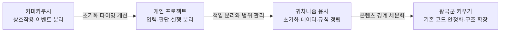
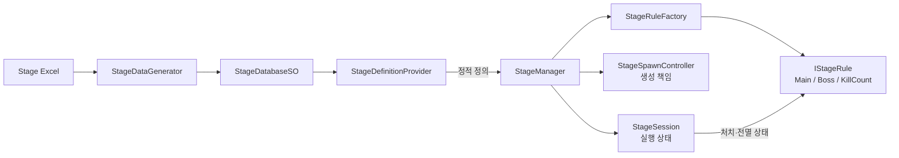
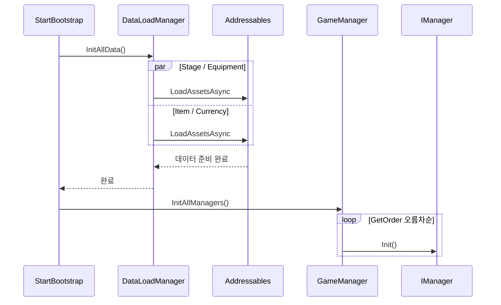
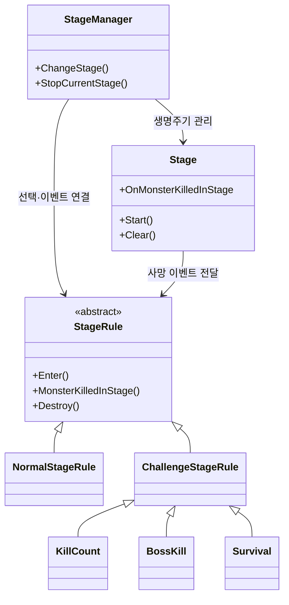
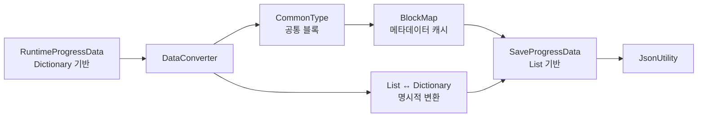
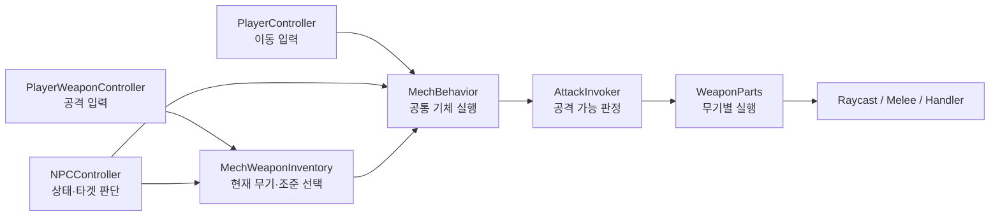
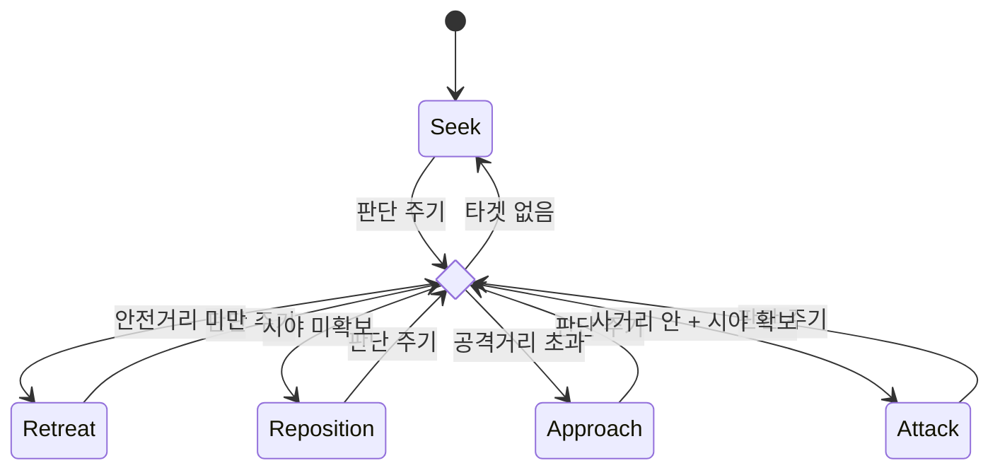
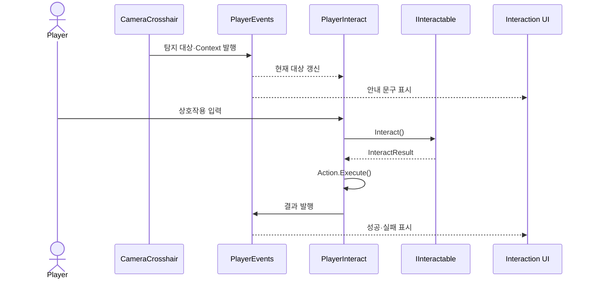

# 문규성 포트폴리오 — 기술 리드 중심 개정안


Unity와 C#을 기반으로 전투, 스테이지, 데이터 저장·로드, 상호작용 시스템을 설계하고 구현해 온 게임 클라이언트 개발자 지원자입니다.

프로젝트를 반복하며 이전 구현의 한계를 다음 설계 원칙으로 전환해 왔습니다. 팀 프로젝트에서는 인원 관리보다 **공통 프레임워크**, **초기화·데이터 규약**, **기능 간 책임 경계**, **통합 기준**을 세우는 기술 리드 역할을 맡았습니다.

새 기능을 빠르게 추가하는 것뿐 아니라, 어떤 데이터가 언제 준비되는지, 누가 상태를 소유하는지, 실패했을 때 어디까지 복구할 수 있는지를 먼저 고민합니다. 최근에는 실제 출시를 목표로 한 기존 코드베이스에 합류해 팀원이 만든 구조의 의도를 보존하면서 스테이지·장비·로딩 흐름을 개선하고 있습니다.

<br clear="left"/>

## 기술 스택

| 구분 | 기술 |
| --- | --- |
| Language |  |
| Engine |  |
| Async / Asset |   |
| Data |   |
| Collaboration |    |

## 핵심 역량

- **반복 개선**: 이전 프로젝트의 초기화·결합도·일정 문제를 다음 프로젝트의 설계 기준으로 전환
- **기술 리딩과 통합**: 공통 프레임워크와 초기화·데이터·이벤트 규약을 정의하고 팀 기능을 하나의 실행 흐름으로 통합
- **책임과 상태 경계 설계**: 정적 데이터/실행 상태, 정책/실행, 보유/장착, 입력/실행을 분리
- **기존 코드 분석과 안정화**: 새 구조를 만드는 것뿐 아니라 기존 코드의 암묵적 가정과 생명주기 오류 가능성을 찾아 개선
- **트레이드오프 판단**: 현재 구조의 한계와 다음 분리 시점을 구현 결과와 함께 설명

## 프로젝트를 통해 만든 성장 흐름

| 단계 | 프로젝트 | 확인한 한계 | 다음 프로젝트에 적용한 기준 |
| --- | --- | --- | --- |
| 1 | 카미카쿠시 | 이벤트 기반 분리만으로 초기화 순서까지 보장할 수 없었음 | 기능 구현 전 데이터 준비 시점과 진입 순서를 명시 |
| 2 | 그때 갑자기 건담이 나타났다 | UI 일정 편중과 일부 클래스의 과도한 책임 | 핵심 루프 완료 기준을 먼저 정하고 실행 책임을 단계화 |
| 3 | 귀차니즘 용사 | 정수 우선순위와 분기 기반 규칙 선택의 확장 한계 | 데이터 정의·실행 상태·규칙·생성 책임을 더 세분화 |
| 4 | 왕국군 키우기 | 기존 시스템에 남은 결과 순서·중복 요청·생명주기 가정 | 기존 의도를 보존하면서 로딩과 콘텐츠 경계를 안정화 |



## 프로젝트 목차

| 상태 | 프로젝트 | 장르 | 기간 | 역할 | 링크 |
| --- | --- | --- | --- | --- | --- |
| 출시 준비 중 | [왕국군 키우기](#project-k) | 방치형 RPG | 프로젝트 2026.02–진행 중<br/>본인 참여 2026.05–진행 중 | 클라이언트 개발 | [YouTube](https://www.youtube.com/watch?v=PBKFwkjvW5U) |
| 완료 | [귀차니즘 용사](#idle-hero) | 방치형 RPG | 2026.03.03–2026.04.15 | 클라이언트 리드·공통 프레임워크 | [GitHub](https://github.com/ks0521/TeamProject) · [YouTube](https://youtu.be/7LdXl2Ow0QU) |
| 완료 | [그때 갑자기 건담이 나타났다](#personal-project) | TPS 로그라이크 | 집중 개발 2026.01.29–2026.02.27<br/>후속 보완 2026.03–04 | 1인 개발 | [GitHub](https://github.com/ks0521/SingleProject) |
| 완료 | [카미카쿠시](#kamikakushi) | 공포 | 2025.12.10–2025.12.26 | 클라이언트 리드·게임플레이 통합 | [GitHub](https://github.com/ks0521/First-Game-Project) · [YouTube](https://www.youtube.com/watch?v=v1zOEZXVuqY) |

---

<a id="project-k"></a>
# 진행 중 프로젝트: 왕국군 키우기

<p align="center">
  <a href="https://www.youtube.com/watch?v=PBKFwkjvW5U">
    
  </a>
</p>

<p align="center">
  <b>기존 프로토타입을 실제 출시 가능한 구조로 확장 중인 방치형 RPG</b><br/>
  <sub>스테이지·던전, 환생, 공용 장비 구조를 구현하고 기존 로딩 파이프라인을 안정화했습니다.</sub>
</p>

- 프로젝트 기간: 2026.02–진행 중
- 본인 참여 기간: 2026.05–진행 중
- 현재 팀 구성: 3인 개발
- 본인 역할: 클라이언트 개발
- 개발 환경: Unity 6, C#, UniTask, Addressables
- 현재 상태: 핵심 콘텐츠 통합 및 출시 준비

<a id="project-k-stage"></a>
## 핵심 기여 1. 스테이지 데이터·실행 상태·규칙 분리

> **문제**  
> 기존 흐름에서는 메인 스테이지 진행, 몬스터 생명주기, 클리어 판정, 던전 진입·복귀가 여러 매니저에 걸쳐 있었습니다. 진행 방식이 다른 콘텐츠가 늘어날수록 기존 코드를 함께 수정해야 했습니다.

### 해결

- `StageDefinition`: Excel에서 생성된 정적 콘텐츠 정의
- `StageSession`: 현재 스테이지의 몬스터·처치·실행 상태
- `IStageRule`: 성공·실패 조건과 진행 방식
- `StageRuleFactory`: 정의된 흐름에 맞는 규칙 생성
- `StageSpawnController`: 몬스터 생성과 배치
- `StageManager`: 각 요소를 조합하고 진입·종료·복귀 조정



실제 규칙 선택은 데이터에 기록된 `FlowType`을 기준으로 팩토리가 담당합니다.

```csharp
public static IStageRule Create(StageDefinition definition)
{
    return definition.FlowType switch
    {
        eStageFlowType.MainProgression   => new MainStageRule(),
        eStageFlowType.BossChallenge    => new BossStageRule(),
        eStageFlowType.KillCountChallenge => new KillCountRule(),
        _ => throw new ArgumentOutOfRangeException(nameof(definition.FlowType))
    };
}
```

### 결과

- 스테이지 정의, 실행 중 상태, 판정 규칙의 변경 이유를 분리했습니다.
- 메인 진행 상태를 보존한 채 골드·루비 던전에 진입하고 복귀하는 흐름을 추가했습니다.
- 클리어 이벤트를 퀘스트 등 다른 콘텐츠가 구독할 수 있는 기준점으로 만들었습니다.
- 새 진행 규칙을 추가할 때 기존 스폰·세션 코드를 직접 수정하는 범위를 줄였습니다.

### 현재 한계

`StageManager`가 아직 진입·복귀·팝업 이벤트까지 조정하는 큰 클래스입니다. 콘텐츠 종류가 더 늘어나면 화면 전환과 사용자 피드백을 별도 플로 컨트롤러로 분리할 필요가 있습니다. 데이터 생성과 리소스 로딩 실패 후 사용자가 다시 시도할 수 있는 복구 흐름도 출시 전 검증 대상입니다.

## 핵심 기여 2. 기존 씬·Addressables 로딩 파이프라인 안정화

이 영역은 Addressables와 SFX/VFX 로딩 기반을 처음부터 만든 작업이 아닙니다. 팀원이 먼저 구축한 흐름을 실제 콘텐츠와 연결하면서 암묵적인 가정과 생명주기 경계를 찾아 개선했습니다.

| 기존 팀 구현 | 본인이 개선한 범위 |
| --- | --- |
| Addressables 메타데이터와 자동 등록 기반 | 요청 ID와 결과 배열 인덱스가 같다는 가정 제거 |
| SFX/VFX 매니저와 프리로드 기능 | 중복 요청 방지와 진행 중 작업 재사용 |
| 씬·스테이지별 리소스 로딩 | `sceneLoaded` 후처리와 `Start()` 초기화 순서 보완 |
| 개별·배치 handle 관리 | 캐시와 handle의 해제 책임을 해당 매니저로 정리 |
| `GameManager` 중심 호출 | 요청·대기·Unity 씬 전환·후처리를 `LoadManager`로 분리 |

### 의미

새 프레임워크를 처음부터 만드는 능력뿐 아니라, 다른 개발자의 코드를 읽고 기존 의도를 보존하면서 오류 가능성을 줄인 경험입니다. 포트폴리오에서는 이를 “Addressables 시스템 구현”이 아니라 **기존 로딩 파이프라인 안정화와 책임 분리**로 한정해 설명합니다.

### 현재 한계

씬 종류 선택은 아직 `switch`에 남아 있고, 로딩 실패 시 로그 이후의 사용자 복구 UX는 완성되지 않았습니다. 출시 전에는 중복 전환, 취소, 실패, 재시도 시나리오를 빌드 기준으로 검증할 예정입니다.

## 핵심 기여 3. 정책과 실행을 분리한 로컬 환생 프로토타입

> **문제**  
> 환생 조건, 보상 계산, 저장, 스테이지 초기화를 한 흐름에서 처리하면 중간 실패 시 저장 상태와 현재 스테이지가 어긋날 수 있습니다.

### 해결

- `ReincarnationPolicy`: 현재 상태와 스테이지를 바탕으로 가능 여부와 다음 상태 계산
- `ReincarnationService`: 미리보기, 중복 실행 방지, 저장·초기화 순서 조정
- `ReincarnationStore`: 스키마 버전과 손상 데이터를 고려한 로컬 저장
- `ReincarnationGateway`: 환생 로직이 `StageManager` 구현을 직접 알지 않도록 전환 요청 캡슐화

스테이지 초기화 요청이 거절되면 저장했던 환생 상태를 이전 값으로 되돌립니다.

```csharp
if (!_store.TrySave(preview.NextState))
    return ReincarnationExecutionResult.SaveFailed;

if (!_stageGateway.TryResetToStartStage())
{
    if (!_store.TrySave(previousState))
        return ReincarnationExecutionResult.RollbackFailed;

    return ReincarnationExecutionResult.StageResetRejected;
}
```

### 현재 한계

현재 구현은 `PlayerPrefs` JSON 기반 로컬 프로토타입입니다. 스테이지 전환 요청 수락이 실제 비동기 로딩 완료를 보장하지 않으므로, 서버 도입 시 환생 상태와 시작 스테이지를 하나의 트랜잭션으로 확정해야 합니다.

## 핵심 기여 4. 공용 인벤토리와 캐릭터 장착 상태 분리

> **문제**  
> 보유 장비와 캐릭터별 장착 상태가 같은 매니저에 섞이면 가챠·보상·강화·UI가 특정 캐릭터 객체를 직접 참조하게 됩니다.

### 해결과 결과

전역 `EquipmentManager`가 공용 인벤토리, 드롭, 강화 진입점을 담당하고 각 캐릭터의 `PlayerEquipmentManager`가 장착과 스탯 반영을 담당하도록 분리했습니다. `EquipmentInstance`에는 런타임 `Player` 참조 대신 장착 캐릭터 인덱스를 저장했습니다.

가챠·보상·강화·장비 UI는 같은 공용 인벤토리를 사용하고, 장착 중 장비가 강화되면 해당 캐릭터의 스탯을 다시 계산합니다. 서버 저장 도입 시 장착 인덱스 검증과 소유권 복원 규칙을 추가해야 합니다.

## 현재 검증 중인 항목

- 메인 전투 → 보상 → 성장 → 저장으로 이어지는 플레이 사이클
- 메인 스테이지와 던전 간 진입·복귀 상태 보존
- 중복 씬 전환, 로딩 취소, 실패 후 재시도
- 로컬 환생 상태와 서버 상태의 트랜잭션 경계
- 공개 빌드 기준 로딩 시간과 리소스 해제 상태 측정

---

<a id="idle-hero"></a>
# 팀 프로젝트: 귀차니즘 용사

<p align="center">
  
  
</p>

<p align="center">
  <b>일반 스테이지 파밍과 보스 돌파로 성장하는 방치형 RPG</b><br/>
  <sub>클라이언트 리드로 공통 프레임워크와 초기화·데이터·이벤트 규약, 통합 흐름을 담당했습니다.</sub>
</p>

- 집중 개발 기간: 2026.03.03–2026.04.15, 약 6주
- 팀 구성: 개발 4인
- 본인 역할: 클라이언트 리드·공통 프레임워크
- 개발 환경: Unity 2022.3.62f3 LTS, C#, UniTask, Addressables
- GitHub: [TeamProject](https://github.com/ks0521/TeamProject)
- 시연 영상: [YouTube](https://youtu.be/7LdXl2Ow0QU)

## 기술 리딩 범위

| 영역 | 담당 내용 |
| --- | --- |
| 공통 프레임워크 | `GameManager` 초기화 체계, 데이터 진입점, `EventHub` 규약 |
| 핵심 시스템 | 스테이지 진행·규칙, 저장·로드 변환, 드롭·오프라인 보상 |
| 팀 통합 | 파트별 기능을 공통 데이터와 이벤트 흐름에 연결하고 통합 씬 구성 |
| 통합 기준 | 어떤 데이터가 언제 준비되는지, 어떤 이벤트를 발행·구독하는지 사전 합의 |
| 후반 안정화 | 통합 빌드에서 기능 간 연결 오류를 추적하고 수정 범위를 조정 |

이 경험에서 강조하려는 리더십은 인원 통제나 업무 지시가 아니라, 여러 개발자가 동시에 작업할 수 있도록 **공통 기술 기준과 연결 지점을 제공한 경험**입니다.

<a id="idle-hero-bootstrap"></a>
## 핵심 구현 1. 데이터 로딩과 매니저 초기화 파이프라인

> **문제**  
> 팀 코드를 통합하면서 Unity 생명주기와 매니저 의존성이 얽혔고, 필수 데이터가 준비되기 전에 시스템이 참조될 위험이 있었습니다.

### 해결

`StartBootstrap`을 단일 진입점으로 두고 Stage, Equipment, Item, Currency 데이터를 병렬 로딩했습니다. 데이터 준비가 끝난 뒤에만 `GameManager`가 `IManager` 구현체를 우선순위대로 초기화합니다.



```csharp
// StartBootstrap.cs
await dataLoadManager.InitAllData(dic);
gameManager.InitAllManagers();

// DataLoadManager.cs
await UniTask.WhenAll(
    LoadAllStage(),
    LoadAllEquipment(),
    LoadAllItems(),
    LoadAllCurrency()
);
```

### 결과

- 네 데이터 그룹의 준비 완료 시점을 매니저 초기화보다 앞에 고정했습니다.
- 신규 매니저는 공통 인터페이스와 우선순위 지정으로 초기화 흐름에 편입할 수 있습니다.
- 데이터 로딩 실패를 부트스트랩 단계에서 한 번에 감지할 수 있습니다.

### 트레이드오프

정수 우선순위는 단순하지만 값 충돌과 숨은 의존성을 만들 수 있습니다. 규모가 커지면 실제 의존 대상을 명시하는 그래프 또는 DI 기반 초기화로 전환해야 합니다.

### 관련 코드

- [StartBootstrap.cs](https://github.com/ks0521/TeamProject/blob/main/Assets/Game/Base/Data/Script/StartBootstrap.cs)
- [DataLoadManager.cs](https://github.com/ks0521/TeamProject/blob/main/Assets/Game/Base/Managers/DataLoadManager.cs)
- [GameManager.cs](https://github.com/ks0521/TeamProject/blob/main/Assets/Game/Base/Managers/GameManager.cs)

## 핵심 구현 2. StageManager / Stage / StageRule 책임 분리

> **문제**  
> 전환, 스폰, 클리어 판정, 보상을 한 흐름에서 처리하면 새로운 규칙을 추가할 때 진행 코드 전체를 수정해야 했습니다.

### 해결



`StageManager`는 전환과 진행 상태, `Stage`는 스폰과 몬스터 생명주기, `StageRule`은 클리어 조건과 보상을 담당합니다. 일반 보상, 처치 수, 보스 처치, 생존 규칙을 기존 진행 흐름에 연결했습니다.

현재 규칙 선택은 `StageManager`의 분기에 남아 있습니다. 이 한계는 다음 프로젝트에서 `StageDefinition`과 `StageRuleFactory`를 도입하는 계기가 됐습니다.

### 관련 코드

- [StageManager.cs](https://github.com/ks0521/TeamProject/blob/main/Assets/Game/Base/Managers/StageManager.cs)
- [Stage.cs](https://github.com/ks0521/TeamProject/blob/main/Assets/Game/Battle/Script/Stage.cs)
- [StageRule.cs](https://github.com/ks0521/TeamProject/blob/main/Assets/Game/Battle/Script/StageRule.cs)

## 핵심 구현 3. 저장 데이터와 런타임 데이터 변환

> **문제**  
> `JsonUtility`는 `Dictionary` 직렬화를 지원하지 않습니다. 저장용 `List`와 런타임용 `Dictionary`를 분리하되, 공통 필드를 모두 수동 복사하면 누락 위험이 생겼습니다.

### 해결



공통 블록은 `[CommonType]`과 Reflection으로 자동 복사하고, 장비·아이템·스탯·스킬처럼 자료구조가 다른 블록만 명시적으로 변환했습니다. 필드 이름과 타입 정보는 `BlockMap`으로 한 번 캐싱합니다.

Reflection은 컴파일 단계 검증이 약하므로 필드 이름 변경 시 경고와 변환 테스트가 필요합니다. 이 프로젝트에서는 구조를 구현했지만 자동화된 회귀 테스트까지 완성하지 못한 점이 남아 있습니다.

### 관련 코드

- [DataConverter.cs](https://github.com/ks0521/TeamProject/blob/main/Assets/Game/Base/Save/DataConverter.cs)
- [CommonTypeData.cs](https://github.com/ks0521/TeamProject/blob/main/Assets/Game/Base/Save/CommonTypeData.cs)

## 회고: 기능 구현자에서 공통 기준을 만드는 개발자로

초기화 순서, 데이터 진입점, 이벤트 규약을 기능 통합 전에 합의하면서 팀원이 어떤 데이터를 언제 신뢰할 수 있는지 기준을 만들었습니다. 동시에 정수 우선순위와 분기 기반 규칙 선택의 한계를 확인했습니다.

이 경험은 왕국군 키우기에서 데이터 정의·세션·규칙·생성 책임을 더 세분화하고, 기존 로딩 코드의 생명주기와 해제 책임을 분석하는 기반이 됐습니다.

---

<a id="personal-project"></a>
# 개인 프로젝트: 그때 갑자기 건담이 나타났다

<p align="center">
  
  
</p>

<p align="center">
  <b>불리한 전투를 돌파하며 무작위 보상으로 기체를 강화하는 TPS 로그라이크</b><br/>
  <sub>1인 개발로 입력 주체와 공통 전투 실행, 무기별 공격, 거리·시야 기반 NPC AI를 구현했습니다.</sub>
</p>

- 집중 개발 기간: 2026.01.29–2026.02.27, 약 4주
- 후속 보완: 2026.03–04, 공격 파이프라인 책임 재정리와 오류 수정
- 팀 구성: 1인 개발
- 개발 환경: Unity 2022.3.62f3 LTS, C#, UniTask
- GitHub: [SingleProject](https://github.com/ks0521/SingleProject)

<a id="personal-combat"></a>
## 핵심 구현 1. 입력·판단과 공통 전투 실행 분리

> **문제**  
> 플레이어와 AI가 이동·회전·공격을 각각 구현하면 같은 기체 동작과 무기 판정이 중복됩니다.

### 해결



플레이어 입력과 AI 판단은 각 컨트롤러에 남기고, 실제 이동·회전·피격 경직·공격 요청은 `MechBehavior`가 공통으로 처리합니다. `AttackInvoker`는 재장전과 공격 딜레이를 검사하고 `WeaponParts`가 최종 스탯과 공격 방식을 담당합니다.

### 결과와 한계

- 입력 주체가 달라도 같은 기체 실행 계층을 재사용합니다.
- 공격 실패 지점을 입력 → 무기 선택 → 기체 상태 → 재장전·딜레이 → 실행 단계로 나눠 추적할 수 있습니다.
- 무기별 탄약과 딜레이 상태를 독립적으로 유지할 수 있습니다.

다만 `WeaponParts`가 스탯 계산, 공격 타입 분기, 탄약, 딜레이, 재장전을 함께 담당합니다. 공격 종류가 늘어나면 실행 방식을 전략 객체로 분리하고 명시적인 실패 결과 타입을 반환해야 합니다.

### 관련 코드

- [PlayerController.cs](https://github.com/ks0521/SingleProject/blob/main/Assets/Gundam/Game/Script/Contents/Player/PlayerController.cs)
- [NPCController.cs](https://github.com/ks0521/SingleProject/blob/main/Assets/Gundam/Game/Script/Contents/NPC/NPCController.cs)
- [MechBehavior.cs](https://github.com/ks0521/SingleProject/blob/main/Assets/Gundam/Game/Script/Contents/Mech/MechBehavior.cs)
- [AttackInvoker.cs](https://github.com/ks0521/SingleProject/blob/main/Assets/Gundam/Game/Script/Contents/Mech/AttackInvoker.cs)
- [WeaponParts.cs](https://github.com/ks0521/SingleProject/blob/main/Assets/Gundam/Game/Script/Contents/Weapon/WeaponParts.cs)

## 핵심 구현 2. 거리·시야 기반 NPC 상태 전이

일정 판단 주기마다 타겟 유효성, 거리, 시야를 확인해 다섯 개의 활성 상태를 선택합니다.



공격 거리·안전거리·판단 주기는 ScriptableObject로 분리해 기체별 성향을 조정할 수 있게 했습니다. `Stunned` enum과 실행 분기는 존재하지만 실제 전이 조건은 비활성화되어 활성 상태도에는 포함하지 않았습니다.

현재는 `NPCController`의 `switch`가 전이와 실행을 함께 관리합니다. 상태별 부가 효과와 전이가 늘어날 때 독립 State 객체로 옮기는 것이 적절합니다.

## 회고: 구조보다 먼저 완료 기준을 정해야 했다

전투·보상·최종 전투 루프는 완성했지만 UI 일정이 커지면서 난이도 곡선과 적 조합을 충분히 고도화하지 못했습니다. 이후 프로젝트에서는 핵심 루프의 완료 기준을 먼저 정하고 부가 기능과 구조 개선을 단계적으로 배치했습니다.

이 프로젝트에서 익힌 입력·판단·실행의 책임 분리는 귀차니즘 용사의 스테이지 실행·규칙·보상 분리로 확장됐습니다.

---

<a id="kamikakushi"></a>
# 팀 프로젝트: 카미카쿠시

<p align="center">
  
  
  
</p>

<p align="center">
  <b>마을을 탐색하며 단서를 모으고 선택에 따라 결말이 달라지는 공포 게임</b><br/>
  <sub>클라이언트 리드로 상호작용 공통 구조와 플레이어 게임플레이 통합을 담당했습니다.</sub>
</p>

- 집중 개발 기간: 2025.12.10–2025.12.26, 약 2주
- 팀 구성: 기획 1인, 아트 1인, 개발 3인
- 본인 역할: 클라이언트 리드·게임플레이 통합
- 개발 환경: Unity 2022.3.62f2 LTS, C#, Coroutine
- GitHub: [First-Game-Project](https://github.com/ks0521/First-Game-Project)
- 시연 영상: [YouTube](https://www.youtube.com/watch?v=v1zOEZXVuqY)

<a id="kamikakushi-interaction"></a>
## 핵심 구현. 조합형 상호작용과 이벤트 기반 UI 흐름

> **문제**  
> Raycast 탐지, 조건 검사, 상태 변경, UI 표시를 한 컴포넌트가 담당하면 오브젝트가 늘어날수록 플레이어와 UI 코드가 함께 커집니다.

### 해결

- `CameraCrosshair`: Raycast와 대상 탐지
- `PlayerEvents`: 대상·문맥·상호작용 결과 전달
- `PlayerInteract`: 입력과 실제 실행
- `IInteractable`: 모든 상호작용 대상의 공통 진입점
- `IInteractionCondition`: 실행 가능 조건
- `IInteractAction`: 성공 후 실행할 동작



| 오브젝트 | 조건 | 액션 |
| --- | --- | --- |
| 일반 아이템 | 없음 | 아이템 획득, 오브젝트 제거 |
| 잠긴 문 | 열쇠 보유 | 열쇠 소비, 문 열기 |
| 회복 아이템 | 없음 | 체력 회복, 오브젝트 제거 |
| 단서 | 특정 진행 단계 | 목표 변경, 안내 표시 |
| 엔딩 트리거 | 선택 완료 | 엔딩 상태 변경, 씬 전환 |

### 결과와 한계

새 오브젝트는 플레이어 코드를 수정하지 않고 조건과 액션을 조합해 제작할 수 있습니다. 탐지 방식이나 UI 디자인을 변경해도 상호작용 오브젝트 구현을 함께 바꿀 필요가 없습니다.

반면 컴포넌트 수가 늘어나면 Inspector만으로 실행 순서와 구성을 파악하기 어렵고, 이벤트 구독 해제 누락은 중복 호출을 만들 수 있습니다. 구성 검증 도구와 명시적인 우선순위 규칙이 후속 개선 대상입니다.

### 관련 코드

- [CameraCrosshair.cs](https://github.com/ks0521/First-Game-Project/blob/main/Assets/_Kamikakushi/Scripts/Contents/Player/CameraCrosshair.cs)
- [PlayerEvents.cs](https://github.com/ks0521/First-Game-Project/blob/main/Assets/_Kamikakushi/Scripts/Contents/Player/PlayerEvents.cs)
- [PlayerInteract.cs](https://github.com/ks0521/First-Game-Project/blob/main/Assets/_Kamikakushi/Scripts/Contents/Player/PlayerInteract.cs)
- [IInteractable.cs](https://github.com/ks0521/First-Game-Project/blob/main/Assets/_Kamikakushi/Scripts/Utills/Interfaces/IInteractable.cs)
- [IInteractionCondition.cs](https://github.com/ks0521/First-Game-Project/blob/main/Assets/_Kamikakushi/Scripts/Utills/Interfaces/IInteractionCondition.cs)
- [IInteractAction.cs](https://github.com/ks0521/First-Game-Project/blob/main/Assets/_Kamikakushi/Scripts/Utills/Interfaces/IInteractAction.cs)

## 회고: 기술 리드에게 공통 구조만큼 중요한 것은 통합 순서였다

개발 중 인원 이탈에 맞춰 대형 맵 계획을 튜토리얼·단서 탐색·선택 분기·멀티 엔딩 구조로 축소했습니다. 완성 가능한 플레이 루프를 남기는 것을 우선했고, 상호작용 인터페이스와 이벤트 흐름을 공통 연결점으로 사용했습니다.

다만 이벤트 구조를 정의해도 매니저와 데이터의 초기화 순서까지 자동으로 해결되지는 않았습니다. 이 경험이 다음 팀 프로젝트에서 `StartBootstrap → DataLoadManager → GameManager` 순서로 진입점을 고정한 직접적인 출발점이 됐습니다.

---

## 현재의 강점과 다음 목표

### 현재의 강점

- 이전 프로젝트의 실패를 회고에만 남기지 않고 다음 프로젝트의 구조로 반영합니다.
- 여러 개발자가 함께 사용하는 초기화·데이터·이벤트 진입점을 설계하고 통합할 수 있습니다.
- 신규 시스템 구현과 기존 코드베이스 안정화 경험을 모두 가지고 있습니다.
- 설계의 장점뿐 아니라 현재 남은 책임 집중과 실패 경로를 설명할 수 있습니다.

### 다음 목표

- Unity Test Framework 기반으로 스테이지 전환, 저장 변환, 환생 롤백 회귀 테스트 작성
- Profiler와 빌드 로그를 이용한 로딩 시간·메모리·handle 해제 결과 측정
- 큰 Manager를 유스케이스·플로 컨트롤러 단위로 단계적 분리
- 실패 결과 타입과 재시도 UX를 포함한 오류 복구 경로 완성
- PR 설명과 커밋 메시지 규칙을 정리해 기술 의사결정 이력을 저장소에 남기기

> **한 문장 요약**  
> 이전 프로젝트의 한계를 다음 설계에 반영하고, 팀 프로젝트에서는 공통 프레임워크와 통합 기준을 세워 여러 기능을 하나의 안정적인 실행 흐름으로 연결하는 Unity 클라이언트 개발자입니다.
