# 문규성 포트폴리오 — 개정 초안

Unity와 C#을 기반으로 전투, 스테이지, 성장, 데이터 저장/로드 시스템을 설계하고 구현해 온 게임 클라이언트 개발자 지원자입니다.

완성된 기능의 수보다 **초기화 순서**, **데이터와 런타임 상태의 경계**, **클래스별 책임**, **콘텐츠 확장 단위**를 먼저 고민합니다. 최근에는 3인 팀의 실제 출시 목표 프로젝트에 참여해, 기존 코드의 의도를 보존하면서 스테이지·장비 구조를 재설계하고 미완성 기능을 통합하는 경험을 쌓고 있습니다.

이 문서에서는 직접 설계·구현한 영역과 팀원이 먼저 구축한 기반을 구분하고, 구조를 처음부터 만든 경험뿐 아니라 기존 시스템의 오류 가능성을 분석하고 안정화한 과정도 함께 소개합니다.

 

## 기술 스택

| 구분 | 기술 |
| --- | --- |
| Language | C# |
| Engine | Unity 2022.3 LTS, Unity 6 |
| Async / Asset | UniTask, Addressables |
| Data | JSON, ScriptableObject, Excel 기반 데이터 생성 |
| Collaboration | Git, GitHub, Notion |

## 대표 역량

- [콘텐츠 규칙과 런타임 상태 분리](#project-k-stage): 출시 준비 프로젝트의 스테이지·던전 구조 재설계
- [기존 시스템 분석과 안정화](#project-k-loading): 중복 요청, 결과 순서 가정, 초기화 타이밍, 해제 책임 보완
- [초기화·데이터 준비 상태 보장](#idle-hero-bootstrap): Addressables 로딩 이후 매니저 초기화
- [입력 주체와 전투 실행 계층 분리](#personal-combat): 플레이어와 AI의 공통 실행 흐름
- [컴포넌트 조합형 상호작용](#kamikakushi-interaction): 탐지·실행·UI 책임 분리

## 프로젝트 목차

| 상태 | 프로젝트 | 장르 | 기간 | 역할 | 링크 |
| --- | --- | --- | --- | --- | --- |
| 출시 준비 중 | [왕국군 키우기](#project-k) | 방치형 RPG | 프로젝트 2026.02–진행 중 본인 참여 2026.05–진행 중 | 3인 팀 클라이언트 개발 | 공개 범위 협의 후 추가 |
| 완료 | [귀차니즘 용사](#idle-hero) | 방치형 RPG | 2026.03.03–2026.04.15 | 클라이언트 리드 | [GitHub](https://github.com/ks0521/TeamProject) · [YouTube](https://youtu.be/7LdXl2Ow0QU) |
| 완료 | [그때 갑자기 건담이 나타났다](#personal-project) | TPS 로그라이크 | 2026.01.29–2026.02.27 | 1인 개발 | [GitHub](https://github.com/ks0521/SingleProject) |
| 완료 | [카미카쿠시](#kamikakushi) | 공포 | 2025.12.10–2025.12.26 | 클라이언트 리드 | [GitHub](https://github.com/ks0521/First-Game-Project) · [YouTube](https://www.youtube.com/watch?v=v1zOEZXVuqY) |

---

# 진행 중 프로젝트: 왕국군 키우기

> **대표 이미지 추가 예정**  
> 메인 전투 화면 1장과 성장·장비 UI 1장을 공개 가능한 빌드 확보 후 추가합니다.

3명이 실제 출시를 목표로 제작 중인 방치형 RPG입니다. 기존 프로토타입의 기능을 유지하면서 콘텐츠 추가와 운영에 대응할 수 있도록 스테이지, 장비, 성장 구조를 재정리하고 있습니다.

- 프로젝트 기간: 2026.02–진행 중
- 본인 참여 기간: 2026.05–진행 중
- 팀 구성: 3인 개발
- 본인 역할: 클라이언트 개발
- 개발 환경: Unity 6, C#, UniTask, Addressables
- 저장소: 팀 공개 범위 협의 후 추가
- 현재 상태: 핵심 콘텐츠 통합 및 출시 준비 중

## 🧩 핵심 기여 1. 스테이지 데이터·실행 상태·규칙 분리

> **문제**  
> 기존 스테이지 진행은 현재 웨이브 상태, 몬스터 생명주기, 클리어 판정, 다음 콘텐츠 전환이 여러 매니저에 걸쳐 있어 던전처럼 진행 방식이 다른 콘텐츠를 추가할수록 수정 범위가 커졌습니다.

### 해결

정적 콘텐츠 정의는 `StageDefinition`, 현재 실행 중인 몬스터와 처치 상태는 `StageSession`, 성공·실패 판정은 `IStageRule`로 분리했습니다. `StageManager`는 이들을 조합해 메인 진행, 보스 도전, 처치 수 조건, 골드·루비 던전 진입과 복귀를 조정합니다.

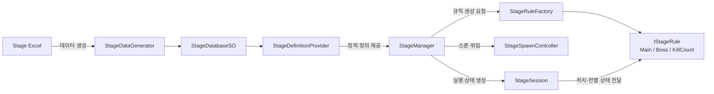

### 결과

- 스테이지 데이터, 실행 중 상태, 판정 규칙의 변경 이유를 분리했습니다.
- 메인 진행 상태를 스냅샷으로 보존한 뒤 던전에 진입하고 복귀하는 흐름을 추가했습니다.
- 스테이지 클리어 이벤트를 퀘스트 등 다른 콘텐츠가 구독할 수 있는 기준점으로 만들었습니다.

### 트레이드오프와 후속 과제

`StageManager`가 아직 진입·복귀·팝업 이벤트까지 조정하므로 콘텐츠 종류가 더 늘어나면 전환 흐름을 별도 컨트롤러로 분리할 필요가 있습니다. 데이터 생성 실패와 리소스 로딩 실패에 대한 사용자 복구 흐름도 출시 전 보강 대상입니다.

## 🧩 핵심 기여 2. 정책과 실행을 분리한 로컬 환생 프로토타입

> **문제**  
> 환생 가능 조건, 보상 계산, 저장, 스테이지 초기화를 한 흐름에서 처리하면 실패 지점에 따라 데이터와 현재 스테이지가 어긋날 수 있습니다.

### 해결

- `ReincarnationPolicy`: 현재 스테이지와 상태를 바탕으로 가능 여부와 다음 상태 계산
- `ReincarnationService`: 미리보기, 중복 실행 방지, 저장과 스테이지 초기화 순서 조정
- `ReincarnationStore`: 스키마 버전과 손상 데이터를 고려한 로컬 저장
- `ReincarnationGateway`: 환생 로직이 `StageManager` 구현에 직접 의존하지 않도록 전환 요청 캡슐화

저장 이후 스테이지 초기화가 거절되면 이전 상태를 다시 저장하는 롤백 경로도 추가했습니다.

### 현재 한계

현재 구현은 `PlayerPrefs` JSON 기반의 로컬 프로토타입입니다. 스테이지 전환 요청 수락이 실제 비동기 로딩 완료를 보장하지 않으며, 서버 도입 시 환생 상태와 시작 스테이지를 하나의 트랜잭션으로 확정해야 합니다.

## 🧩 핵심 기여 3. 공용 인벤토리와 캐릭터 장착 상태 분리

> **문제**  
> 장비 보유 목록과 캐릭터별 장착 상태가 같은 매니저에 섞이면 가챠·보상·강화·UI가 특정 캐릭터 객체를 직접 참조하게 됩니다.

### 해결

전역 `EquipmentManager`가 공용 인벤토리, 드롭, 강화 진입점을 담당하고 `PlayerEquipmentManager`가 캐릭터별 장착과 스탯 반영을 담당하도록 분리했습니다. `EquipmentInstance`에는 런타임 객체 대신 장착 캐릭터 인덱스를 저장해 상태 복원 경계를 명확히 했습니다.

### 결과와 후속 과제

가챠, 보상, 강화, 장비 UI가 동일한 공용 인벤토리를 사용하고, 장착 중 장비가 강화되면 해당 캐릭터 스탯을 즉시 다시 계산합니다. 서버 저장 도입 시 장착 인덱스 검증과 소유권 복원 규칙을 추가해야 합니다.

## 🔧 기존 시스템 분석 및 안정화. 씬·Addressables 로딩 파이프라인

이 영역은 Addressables와 SFX/VFX 로딩 기반을 처음부터 만든 작업이 아닙니다. 팀원이 구축한 흐름을 실제 콘텐츠와 연결하면서 발견한 오류 가능성을 분석하고, 기존 의도를 유지한 채 안정화와 책임 분리를 진행했습니다.

| 기존 팀 구현 | 본인이 개선한 범위 |
| --- | --- |
| Addressables 메타데이터와 자동 등록 기반 | 요청 ID와 결과 배열 인덱스가 같다는 가정 제거 |
| SFX/VFX 매니저와 프리로드 기능 | 중복 씬 전환·리소스 요청 방지 및 진행 중 작업 재사용 |
| 씬·스테이지별 리소스 로딩 흐름 | `sceneLoaded` 후처리와 `Start()` 초기화 순서 보완 |
| 개별·배치 handle 관리 | 캐시와 handle의 해제 책임을 해당 매니저로 정리 |
| `GameManager` 중심 로딩 호출 | 요청·대기·Unity 씬 전환·후처리를 `LoadManager`로 분리 |

### 의미

새 시스템을 단독으로 구현한 사례가 아니라, 다른 개발자의 코드를 읽고 암묵적인 가정과 생명주기 경계를 찾아 수정한 협업 사례입니다. 포트폴리오에서는 이를 “Addressables 시스템 구현”이 아닌 “기존 로딩 파이프라인 안정화 및 책임 분리”로 한정해 설명합니다.

## 현재 진행 중인 검증

- 메인 전투부터 보상·성장·저장까지 이어지는 플레이 사이클 안정화
- 로컬 환생 상태와 서버 상태의 트랜잭션 경계 설계
- 공개 가능한 빌드와 시연 영상 준비
- 팀 저장소 및 코드 공개 범위 협의

---

# 팀 프로젝트: 귀차니즘 용사

  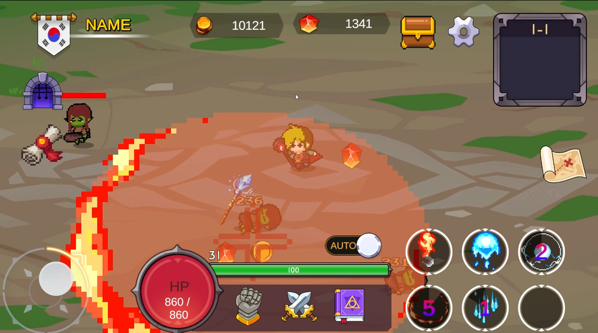
  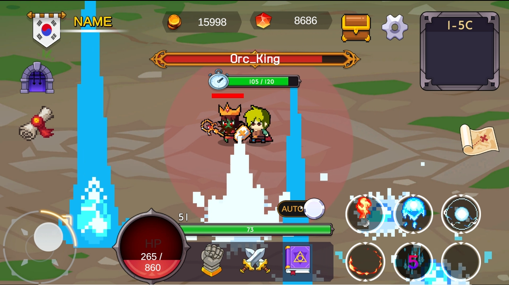

  <b>일반 스테이지 파밍과 보스 스테이지 돌파로 이어지는 방치형 RPG</b> 
  자동 전투, 보상 획득, 성장, 스테이지 해금 흐름을 구현했습니다.

- 개발 기간: 2026.03.03–2026.04.15, 약 6주
- 팀 구성: 개발 4인
- 본인 역할: 클라이언트 리드
- 개발 환경: Unity 2022.3.62f3 LTS, C#, UniTask, Addressables
- GitHub: [TeamProject](https://github.com/ks0521/TeamProject)
- 시연 영상: [YouTube](https://youtu.be/7LdXl2Ow0QU)

## 🧩 핵심 구현 1. 데이터 로딩과 매니저 초기화 파이프라인

> **문제**  
> 팀 코드를 통합하면서 Unity 생명주기와 매니저 의존성이 얽혀 초기화 순서가 달라졌고, 필수 데이터가 준비되기 전에 시스템이 참조될 위험이 있었습니다.

### 해결

`StartBootstrap`을 단일 진입점으로 두고 Stage, Equipment, Item, Currency 데이터를 `UniTask.WhenAll`로 병렬 로딩했습니다. 완료 후 `GameManager`가 `IManager` 구현체를 `GetOrder()` 순서로 정렬해 `Init()`을 호출하도록 구성했습니다.

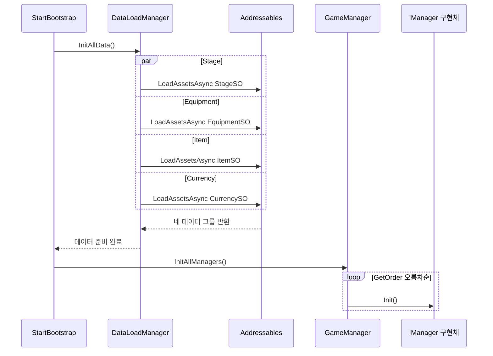

### 결과

- 네 데이터 그룹의 준비 완료 시점을 매니저 초기화보다 앞에 고정했습니다.
- 신규 매니저는 `IManager` 구현과 우선순위 지정으로 초기화 흐름에 편입할 수 있습니다.
- 로딩 실패는 부트스트랩 단계에서 감지하도록 구성했습니다.

### 트레이드오프

정수 우선순위는 단순하지만 값 충돌과 숨은 의존성을 만들 수 있습니다. 규모가 커지면 의존 대상을 명시하는 그래프 또는 DI 기반 초기화로 전환할 필요가 있습니다.

### 관련 코드

- [StartBootstrap.cs](https://github.com/ks0521/TeamProject/blob/main/Assets/Game/Base/Data/Script/StartBootstrap.cs)
- [DataLoadManager.cs](https://github.com/ks0521/TeamProject/blob/main/Assets/Game/Base/Managers/DataLoadManager.cs)
- [GameManager.cs](https://github.com/ks0521/TeamProject/blob/main/Assets/Game/Base/Managers/GameManager.cs)

## 🧩 핵심 구현 2. StageManager / Stage / StageRule 책임 분리

> **문제**  
> 스테이지 전환, 몬스터 스폰, 클리어 조건, 보상을 한 흐름에서 처리하면 신규 규칙을 추가할 때 진행 코드 전체를 수정해야 했습니다.

### 해결

`StageManager`는 전환과 진행 상태, `Stage`는 몬스터 스폰과 생명주기, `StageRule`은 클리어 조건과 보상을 담당합니다. `Stage`의 몬스터 사망 이벤트를 현재 규칙에 연결해 실행과 판정을 분리했습니다.

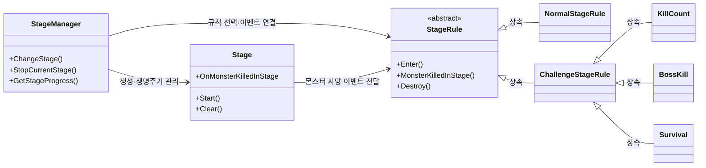

### 결과

일반 보상, 처치 수, 보스 처치, 생존 규칙을 기존 진행 흐름에 조합할 수 있게 됐고 규칙별 수정 범위를 줄였습니다.

### 트레이드오프

현재 규칙 선택은 `StageManager`의 `ClearType` 분기에 남아 있습니다. 규칙 종류가 더 늘어나면 팩토리 또는 데이터 기반 등록 방식으로 선택 책임을 옮기는 것이 적합합니다.

### 관련 코드

- [StageManager.cs](https://github.com/ks0521/TeamProject/blob/main/Assets/Game/Base/Managers/StageManager.cs)
- [Stage.cs](https://github.com/ks0521/TeamProject/blob/main/Assets/Game/Battle/Script/Stage.cs)
- [StageRule.cs](https://github.com/ks0521/TeamProject/blob/main/Assets/Game/Battle/Script/StageRule.cs)

## 🧩 핵심 구현 3. 저장 데이터와 런타임 데이터 변환

> **문제**  
> `JsonUtility`는 `Dictionary` 직렬화를 지원하지 않아 저장용 `List`와 런타임용 `Dictionary`를 분리해야 했고, 공통 필드를 모두 수동 복사하면 누락 위험이 커졌습니다.

### 해결

공통 데이터 블록은 `[CommonType]`과 Reflection으로 자동 복사하고, 장비·아이템·스탯·스킬처럼 `List ↔ Dictionary` 변환이 필요한 블록만 명시적으로 변환했습니다. 이름과 타입이 일치하는 필드 정보는 `BlockMap`으로 한 번 캐싱합니다.

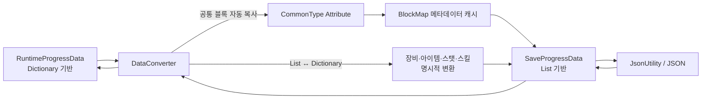

### 결과

저장과 런타임에 각각 적합한 자료구조를 유지하면서 공통 필드의 반복 복사를 줄였습니다.

### 트레이드오프

Reflection 기반 매핑은 컴파일 단계 검증이 약합니다. 필드 이름 변경 시 경고와 변환 테스트로 누락을 확인해야 하며, 성능 민감 경로에서는 캐싱된 메타데이터만 사용해야 합니다.

### 관련 코드

- [DataConverter.cs](https://github.com/ks0521/TeamProject/blob/main/Assets/Game/Base/Save/DataConverter.cs)
- [CommonTypeData.cs](https://github.com/ks0521/TeamProject/blob/main/Assets/Game/Base/Save/CommonTypeData.cs)

## 회고

초기화 순서, 데이터 진입점, 이벤트 규약을 기능 구현 전에 합의하면서 병렬 작업 중 어떤 데이터를 언제 신뢰할 수 있는지 기준을 만들었습니다. 동시에 수동 우선순위와 분기 기반 규칙 선택의 한계를 확인했고, 이 경험을 왕국군 키우기의 데이터 정의·세션·규칙 분리로 확장했습니다.

---

# 개인 프로젝트: 그때 갑자기 건담이 나타났다

  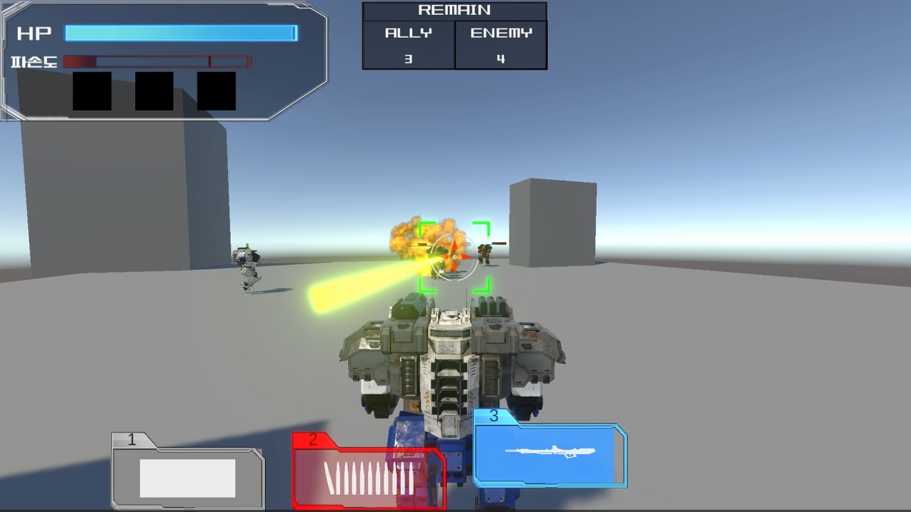
  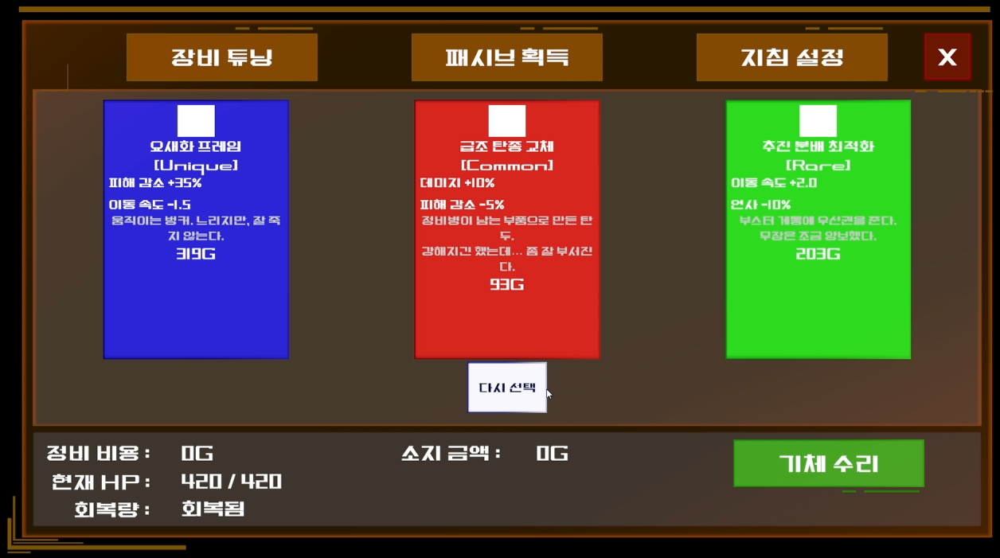

  <b>불리한 전투 상황을 돌파하며 무작위 보상으로 기체를 강화하는 TPS 로그라이크</b> 
  1인 개발로 입력 주체와 공통 전투 실행, 무기별 공격, 거리·시야 기반 NPC AI를 구현했습니다.

- 개발 기간: 2026.01.29–2026.02.27, 총 4주
- 팀 구성: 1인 개발
- 개발 환경: Unity 2022.3.62f3 LTS, C#, UniTask
- GitHub: [SingleProject](https://github.com/ks0521/SingleProject)
- 기획서: [Notion](https://www.notion.so/2f110afad1cd80fd868de0a4df86b3fe)

## 🧩 핵심 구현 1. 입력·판단과 공통 전투 실행 파이프라인

> **문제**  
> 플레이어와 AI가 이동·공격을 각각 구현하면 같은 기체 동작과 무기 판정이 중복되고 수정 지점이 늘어납니다.

### 해결

이동 입력은 `PlayerController`, 공격 입력은 `PlayerWeaponController`, AI 판단은 `NPCController`가 담당합니다. 두 공격 주체는 `MechWeaponInventory`를 통해 현재 무기와 조준 정보를 전달하고, `MechBehavior → AttackInvoker → WeaponParts`가 공통 실행과 무기별 분기를 담당합니다.

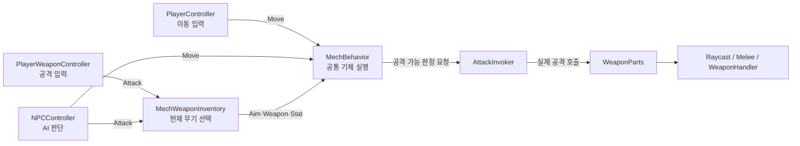

### 결과

- 입력과 판단 주체가 달라도 이동과 공격 실행 계층을 재사용합니다.
- `AttackInvoker`는 재장전·공격 딜레이를 검사하고 `WeaponParts`는 최종 스탯과 공격 방식을 담당합니다.
- Raycast, 근접 공격, handler 기반 공격을 동일한 무기 진입점에서 분기합니다.

### 트레이드오프

파이프라인이 여러 컴포넌트를 통과해 작은 프로젝트에서는 추적 비용이 늘어납니다. 각 단계의 책임과 실패 로그를 유지해야 분리의 이점이 살아납니다.

### 관련 코드

- [PlayerController.cs](https://github.com/ks0521/SingleProject/blob/main/Assets/Gundam/Game/Script/Contents/Player/PlayerController.cs)
- [PlayerWeaponController.cs](https://github.com/ks0521/SingleProject/blob/main/Assets/Gundam/Game/Script/Contents/Player/PlayerWeaponController.cs)
- [NPCController.cs](https://github.com/ks0521/SingleProject/blob/main/Assets/Gundam/Game/Script/Contents/NPC/NPCController.cs)
- [MechWeaponInventory.cs](https://github.com/ks0521/SingleProject/blob/main/Assets/Gundam/Game/Script/Contents/Mech/MechWeaponInventory.cs)
- [MechBehavior.cs](https://github.com/ks0521/SingleProject/blob/main/Assets/Gundam/Game/Script/Contents/Mech/MechBehavior.cs)
- [AttackInvoker.cs](https://github.com/ks0521/SingleProject/blob/main/Assets/Gundam/Game/Script/Contents/Mech/AttackInvoker.cs)
- [WeaponParts.cs](https://github.com/ks0521/SingleProject/blob/main/Assets/Gundam/Game/Script/Contents/Weapon/WeaponParts.cs)

## 🧩 핵심 구현 2. 거리·시야 기반 NPC 상태 전이

> **문제**  
> 단순 추적과 공격만으로는 안전거리, 장애물, 사거리 변화에 대응하기 어렵고 행동 값을 코드 수정 없이 조정하기도 어렵습니다.

### 해결

일정 판단 주기마다 타겟 유효성, 거리, 시야를 계산해 다섯 개의 활성 상태를 선택합니다. 공격 거리·안전거리·판단 주기 같은 값은 ScriptableObject 파라미터로 분리했습니다.

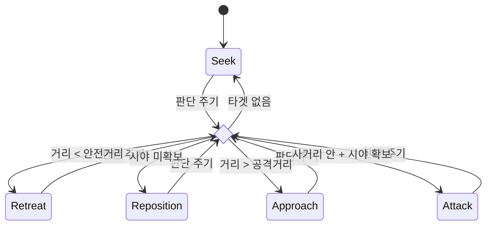

### 상태별 실행

- `Seek`: 타겟 탐색 또는 정지
- `Approach`: 타겟 방향 접근
- `Retreat`: 안전거리 밖으로 후퇴
- `Reposition`: 시야 확보를 위한 측면 이동
- `Attack`: 공격과 저속 측면 이동

### 트레이드오프와 미완성 범위

`Stunned` enum과 실행 분기는 존재하지만 실제 전이 조건은 비활성화되어 현재 상태도에는 포함하지 않았습니다. 상태와 전이 수가 더 늘어나면 `NPCController`의 switch를 독립 State 객체로 분리하는 편이 적합합니다.

### 관련 코드

- [NPCController.cs](https://github.com/ks0521/SingleProject/blob/main/Assets/Gundam/Game/Script/Contents/NPC/NPCController.cs)
- [AIParameter.cs](https://github.com/ks0521/SingleProject/blob/main/Assets/Gundam/Game/SO/Mech/MechParameter/AIParameter.cs)

## 회고

핵심 전투·보상 루프는 완성했지만 UI 일정이 커지면서 난이도 곡선과 적 조합을 충분히 고도화하지 못했습니다. 이후 프로젝트에서는 핵심 루프의 완료 기준을 먼저 정하고, 부가 기능과 구조 개선을 단계적으로 배치하고 있습니다.

---

# 팀 프로젝트: 카미카쿠시

  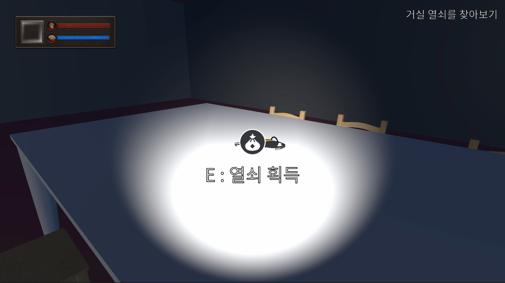
  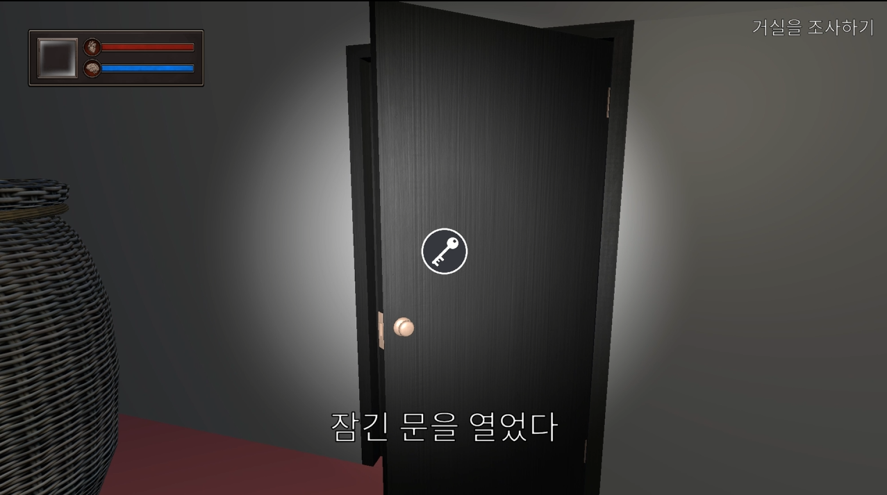
  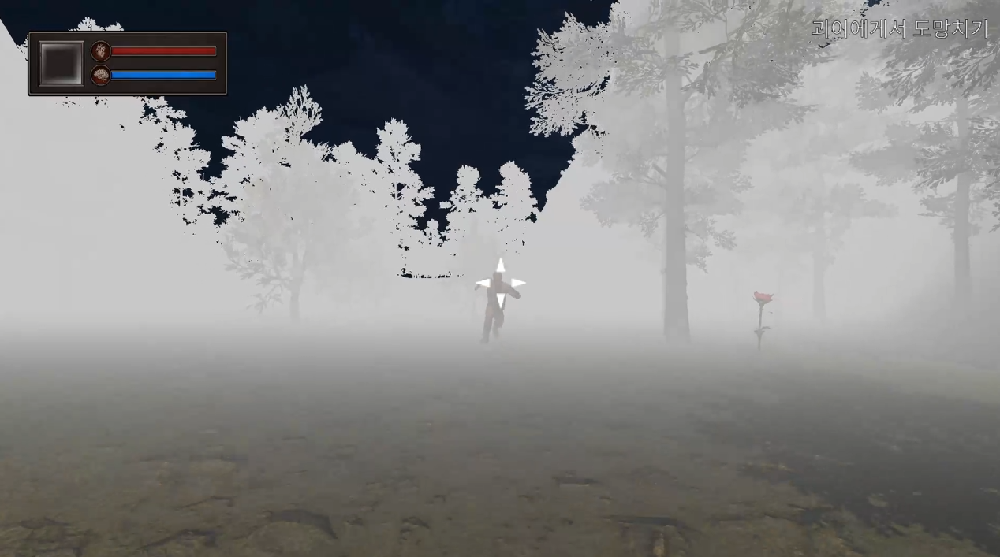

  <b>마을을 탐색하며 단서를 수집하고 선택에 따라 사건의 결말이 달라지는 공포 게임</b> 
  인터페이스 기반 상호작용과 Raycast 탐지, 이벤트 기반 UI 반응을 구현했습니다.

- 개발 기간: 2025.12.10–2025.12.26, 약 2주
- 팀 구성: 기획 1인, 아트 1인, 개발 3인
- 본인 역할: 클라이언트 리드
- 개발 환경: Unity 2022.3.62f2 LTS, C#, Coroutine
- GitHub: [First-Game-Project](https://github.com/ks0521/First-Game-Project)
- 시연 영상: [YouTube](https://www.youtube.com/watch?v=v1zOEZXVuqY)

## 🧩 핵심 구현. 탐지·상호작용·UI 이벤트 흐름

> **문제**  
> 한 컴포넌트가 Raycast 탐지, 조건 검사, 상태 변경, UI 표시까지 담당하면 오브젝트 종류가 늘어날수록 플레이어 코드와 UI 의존성이 함께 커집니다.

### 해결

`CameraCrosshair`는 탐지, `PlayerEvents`는 대상·문맥·결과 전달, `PlayerInteract`는 입력과 실행을 담당합니다. 상호작용 오브젝트는 `IInteractionCondition`과 `IInteractAction` 컴포넌트를 조합합니다.

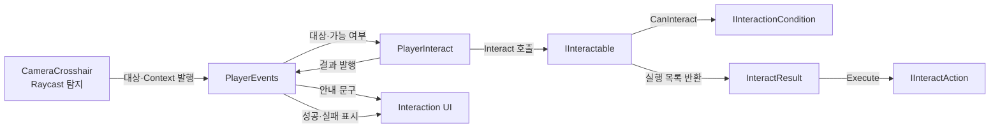

### 결과

- 아이템, 문, 단서 등은 기존 플레이어 코드를 수정하지 않고 조건과 액션을 조합해 추가할 수 있습니다.
- 탐지 대상이 바뀌면 UI와 실행 로직이 이벤트를 통해 각각 반응합니다.
- 상호작용 가능 여부, 실제 상태 변경, 결과 표시의 수정 지점을 분리했습니다.

### 트레이드오프

전역 이벤트는 결합도를 낮추지만 구독 해제 누락과 호출 경로 추적 비용을 만듭니다. 통합 단계에서 매니저 초기화 시점도 명확하지 않아 타이밍 이슈를 겪었고, 이 경험이 다음 프로젝트의 명시적 부트스트랩 설계로 이어졌습니다.

### 관련 코드

- [CameraCrosshair.cs](https://github.com/ks0521/First-Game-Project/blob/main/Assets/_Kamikakushi/Scripts/Contents/Player/CameraCrosshair.cs)
- [PlayerEvents.cs](https://github.com/ks0521/First-Game-Project/blob/main/Assets/_Kamikakushi/Scripts/Contents/Player/PlayerEvents.cs)
- [PlayerInteract.cs](https://github.com/ks0521/First-Game-Project/blob/main/Assets/_Kamikakushi/Scripts/Contents/Player/PlayerInteract.cs)
- [IInteractable.cs](https://github.com/ks0521/First-Game-Project/blob/main/Assets/_Kamikakushi/Scripts/Utills/Interfaces/IInteractable.cs)
- [IInteractionCondition.cs](https://github.com/ks0521/First-Game-Project/blob/main/Assets/_Kamikakushi/Scripts/Utills/Interfaces/IInteractionCondition.cs)
- [IInteractAction.cs](https://github.com/ks0521/First-Game-Project/blob/main/Assets/_Kamikakushi/Scripts/Utills/Interfaces/IInteractAction.cs)
- [InteractItems.cs](https://github.com/ks0521/First-Game-Project/blob/main/Assets/_Kamikakushi/Scripts/Contents/Object/Interective%20Object/InteractItems.cs)

## 회고

개발 중 인원 이탈에 맞춰 대형 맵 계획을 튜토리얼·단서 탐색·선택 분기·멀티 엔딩 구조로 축소했습니다. 제한된 일정에서는 기능 수보다 플레이어가 끝까지 경험할 루프를 먼저 확정해야 한다는 기준을 얻었습니다.

---

## 다음 개정에서 확인할 항목

- 왕국군 키우기 대표 이미지와 공개 가능한 시연 영상 추가
- 실제 빌드 기준의 수치와 검증 결과 보강
- Mermaid 확정 후 SVG 변환 및 모바일·PDF 가독성 점검
- 팀 프로젝트별 본인 구현과 팀 기반을 색상 또는 범례로 더 명확히 구분
